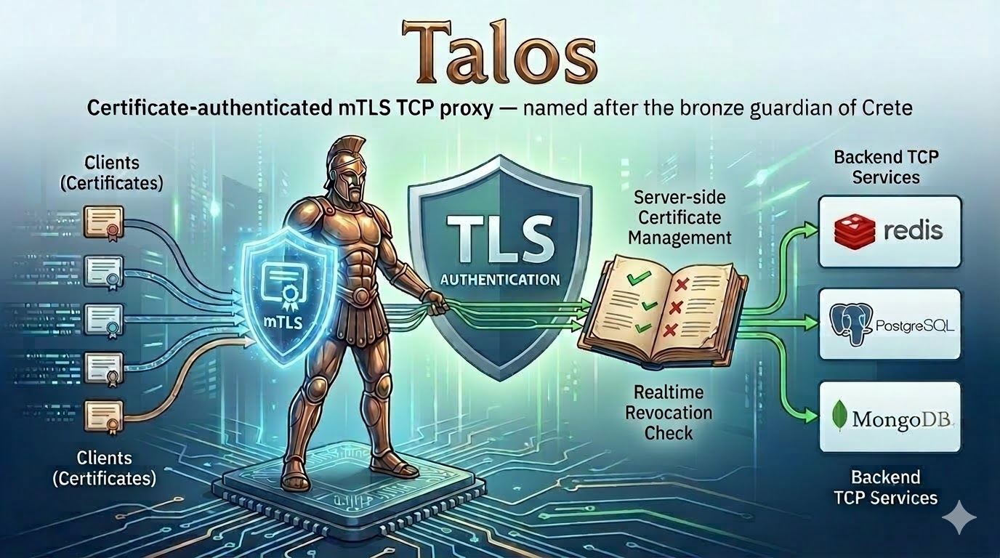

# Talos

<p align="center">
  
</p>

<p align="center">
  <strong>Certificate-authenticated mTLS TCP proxy</strong> — named after the bronze guardian of Crete
</p>

<p align="center">
  <a href="#quick-start">Quick Start</a> &middot;
  <a href="#why">Why Talos?</a> &middot;
  <a href="#cli-reference">CLI Reference</a> &middot;
  <a href="docs/v0.1.0-design.md">Design Doc</a>
</p>

---

Talos sits in front of backend TCP services (Redis, PostgreSQL, MongoDB, etc.) and authenticates every connection using client certificates with real-time revocation checks against a PostgreSQL database.

## TL;DR

```
Client (with cert) → [mTLS] → Talos Proxy → [TCP] → Backend Service
                                  ↕
                            PostgreSQL (cert catalog)
```

- Every client connection requires a valid X.509 client certificate
- Certificate status is checked against a database on each connection (with in-memory caching)
- Revoked certificates are rejected instantly — no CRL distribution lag
- **Fail-closed**: if the database is unreachable, all connections are rejected
- TLS 1.3 by default, session tickets disabled to force full handshake

## Why

GCP managed services (Memorystore, Cloud SQL) don't support per-client certificate revocation. If an employee leaves or a device is compromised, you can't revoke a single client's access without rotating the CA — which breaks every other client. Talos solves this by acting as an authenticating gateway with instant, per-certificate revocation.

## Installation

### Pre-built binaries

Download the latest release from [GitHub Releases](https://github.com/upsidr/talos/releases):

```bash
# Example: Linux (amd64)
curl -LO https://github.com/upsidr/talos/releases/latest/download/talos-linux-amd64.tar.gz
tar xzf talos-linux-amd64.tar.gz
sudo mv talos /usr/local/bin/

# Example: macOS (Apple Silicon)
curl -LO https://github.com/upsidr/talos/releases/latest/download/talos-darwin-arm64.tar.gz
tar xzf talos-darwin-arm64.tar.gz
sudo mv talos /usr/local/bin/
```

Available tarballs: `talos-{linux,darwin}-{amd64,arm64}.tar.gz`

### Build from source

Requires **Go 1.24+**.

```bash
go build -o talos ./cmd/talos
```

### Verify

```bash
talos version
```

## Quick Start

### 1. Start infrastructure

```bash
docker compose up -d   # PostgreSQL 16 + Redis 7
```

### 2. Create config

```bash
cp talos.example.yaml talos.yaml
# Edit talos.yaml — set database.password to "talos" (matches docker-compose)
```

### 3. Initialize CA and generate certificates

```bash
# Generate CA + server certificate (local dev mode)
./talos ca init --out-dir dev --server-hosts localhost

# Issue a client certificate
./talos cert issue alice@example.com --out-dir dev
```

### 4. Start the proxy

```bash
./talos proxy start
# Proxy listens on :8443 (mTLS), forwards to localhost:6379 (Redis)
```

### 5. Connect through the proxy

```bash
redis-cli --tls \
  --cert dev/alice@example.com-v1.crt \
  --key dev/alice@example.com-v1.key \
  --cacert dev/ca.crt \
  -h localhost -p 8443 \
  PING
# → PONG
```

### 6. Test revocation

```bash
./talos cert revoke alice@example.com --reason "test"
# Retry the redis-cli command above → connection rejected
```

## CLI Reference

```
talos proxy start          Start the mTLS proxy server
talos ca init              Initialize CA (local dev mode)
talos cert issue <id>      Issue a client certificate
talos cert revoke <id>     Revoke a certificate
talos cert reissue <id>    Revoke + issue new version
talos cert list            List all certificates
talos cert show <id>       Show certificate details
talos version              Print version
```

All commands accept `-c <path>` to specify a config file (default: `talos.yaml`).

## Configuration

See [`talos.example.yaml`](talos.example.yaml) for a fully documented example. Key settings:

| Setting | Default | Description |
|---|---|---|
| `proxy.listen_address` | `:8443` | Proxy listen address |
| `proxy.backend_address` | — | Target TCP service (required) |
| `tls.min_version` | `1.3` | Minimum TLS version |
| `cache.ttl` | `60s` | Certificate status cache TTL |
| `database.*` | localhost:5432 | PostgreSQL connection |

Environment variables with `TALOS_` prefix override config file values (e.g., `TALOS_DATABASE_PASSWORD`).

## Dev Setup

```bash
# Prerequisites: Go 1.24+, Docker

# Clone and build
git clone https://github.com/upsidr/talos.git
cd talos
go build -o talos ./cmd/talos

# Start PostgreSQL + Redis
docker compose up -d

# Set up config
cp talos.example.yaml talos.yaml
# Edit talos.yaml: set database.password to "talos"

# Run tests
go test ./...

# Initialize CA and start proxy
./talos ca init --out-dir dev --server-hosts localhost
./talos proxy start
```

### Project Structure

```
cmd/talos/           CLI entry point (Cobra commands)
internal/
  config/            YAML config loading with env var overlay
  cert/              Certificate issuance, signing, fingerprinting
  proxy/             mTLS proxy server and TTL cache
  store/             CertificateStore interface + PostgreSQL implementation
docs/                Design documents
```

### Dependencies

| Package | Purpose |
|---|---|
| `pgx/v5` | PostgreSQL driver |
| `cobra` | CLI framework |
| `zap` | Structured logging |
| `go-pkcs12` | PKCS#12 bundle generation |
| `yaml.v3` | Config file parsing |

## Architecture

Talos is a sub-project within the [Elpis](https://github.com/upsidr/elpis) workspace (FreeIPA + Cloudflare Tunnel infrastructure on GCP). See [`docs/design.md`](docs/design.md) for the full design specification.

## License

[Apache License 2.0](LICENSE)
