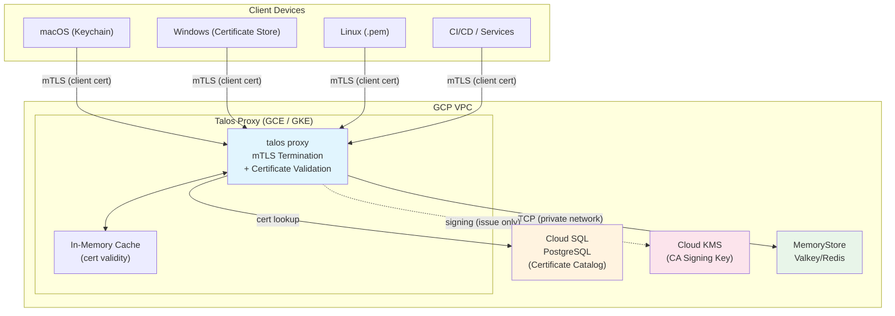
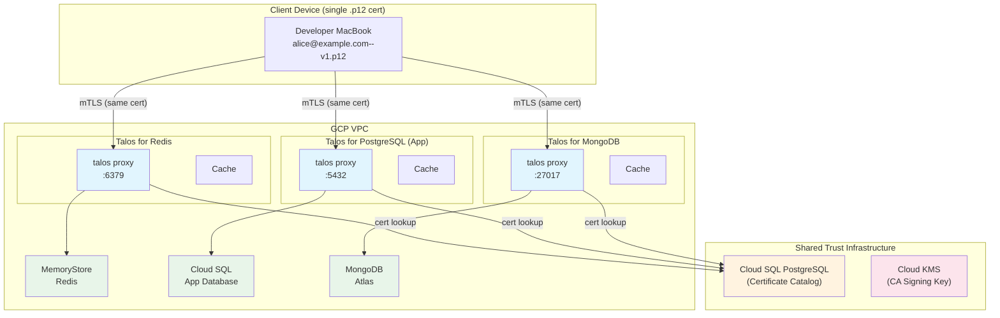
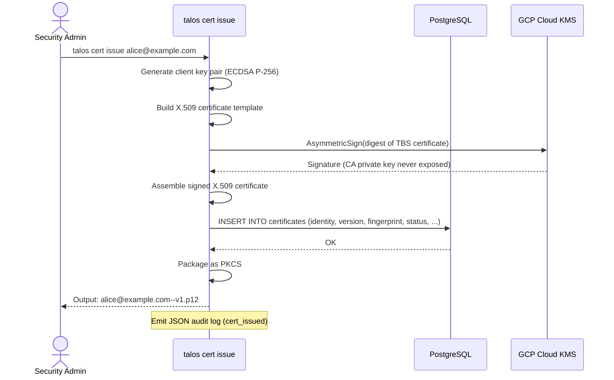
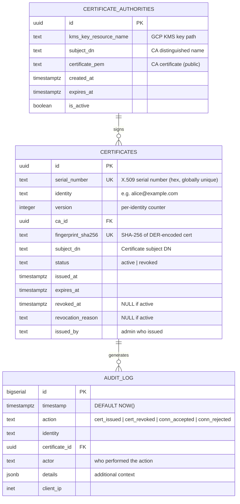

# Talos — Certificate-Authenticated TCP Proxy

> **Talos** (Τάλως): In Greek mythology, the bronze automaton forged by Hephaestus and given to Europa to guard Crete. He circled the island three times each day, intercepting every approaching vessel and deciding who may pass. An automated guardian standing between the outside world and what lies within — a fitting name for a proxy that authenticates every connection before granting access to internal services.


| Field        | Value      |
| ------------ | ---------- |
| Document ID  | 002        |
| Status       | Draft      |
| Author       | —          |
| Created      | 2026-03-11 |
| Last Updated | 2026-03-11 |


---

## Table of Contents

1. [Business Reason](#1-business-reason)
2. [Business Impact](#2-business-impact)
3. [Actors](#3-actors)
4. [Use Cases](#4-use-cases)
5. [Acceptance Criteria](#5-acceptance-criteria)
6. [Architecture](#6-architecture)
7. [Component Design](#7-component-design)
8. [Data Model](#8-data-model)
9. [CLI Interface Design](#9-cli-interface-design)
10. [Application Configuration](#10-application-configuration)
11. [Security Considerations & Critique](#11-security-considerations--critique)
12. [Technical Feasibility Assessment](#12-technical-feasibility-assessment)
13. [Existing OSS Landscape](#13-existing-oss-landscape)
14. [Assumptions](#14-assumptions)
15. [Risks & Mitigations](#15-risks--mitigations)
16. [Future Considerations](#16-future-considerations)

---

## 1. Business Reason

GCP managed services such as **MemoryStore for Valkey/Redis** run inside a VPC and support TLS (v7.2+), but their certificate management model is fundamentally incompatible with zero-trust security:

- **No per-client certificate revocation.** If a device (e.g., a MacBook) is lost or stolen, there is no way to revoke that specific device's access while keeping all other devices connected. The managed service treats all TLS clients equally — it trusts anyone with a valid certificate signed by the configured CA.
- **No certificate lifecycle management.** The managed service has no concept of issuing, versioning, or revoking individual client certificates. Certificate rotation requires coordinated changes across all clients.
- **VPC-only security is not zero-trust.** Services are "safe" only in the sense that network access is restricted. Any host inside the VPC (or connected via VPN/tunnel) can access the service. There is no identity-level access control.

**Talos** solves this by inserting a certificate-authenticated TCP proxy between clients and managed services. The proxy terminates mTLS, validates each client certificate against a managed catalog, and proxies traffic to the backend only for active certificates. Revocation is near-instant — revoke a certificate in the catalog, and the proxy rejects the next connection attempt.

---

## 2. Business Impact


| Dimension                | Impact                                                                                                                                                                                                |
| ------------------------ | ----------------------------------------------------------------------------------------------------------------------------------------------------------------------------------------------------- |
| **Security**             | Per-client certificate revocation enables immediate response to device loss/theft. Meets banking-grade access control requirements for managed services that lack native identity-based controls.     |
| **Compliance**           | Structured JSON audit logs for all certificate operations and connection events, exportable to SIEM (Cloud Logging → BigQuery). Supports SOC2, PCI-DSS, and FISC audit requirements.                  |
| **Operations**           | Unified CLI for certificate lifecycle (issue, revoke, reissue, list, show). Eliminates manual certificate file distribution and rotation across managed services.                                     |
| **Availability**         | Stateless proxy design allows horizontal scaling. PostgreSQL-backed catalog enables concurrent operation across multiple proxy instances.                                                             |
| **Developer Experience** | From a client's perspective, the proxy is transparent — connecting to `talos-proxy:6379` behaves identically to connecting to Redis directly, with the addition of client certificate authentication. |


---

## 3. Actors


| Actor                    | Description                                                                                                                                                      |
| ------------------------ | ---------------------------------------------------------------------------------------------------------------------------------------------------------------- |
| **Platform Engineer**    | Deploys and configures Talos proxy instances. Manages CA key in GCP KMS. Operates the certificate catalog.                                                       |
| **Security Admin**       | Issues and revokes certificates via the CLI. Responds to incidents (lost/stolen devices) by revoking certificates. Reviews audit logs.                           |
| **Developer / End User** | Installs a client certificate on their device (macOS Keychain, Windows Certificate Store, or Linux PEM) and connects to services through Talos.                  |
| **Service Application**  | Automated workloads (CI/CD, cron jobs, backend services) that connect to managed services through Talos using machine certificates.                              |
| **Managed Service**      | The backend service (e.g., MemoryStore Valkey/Redis) that Talos proxies to. Unaware of Talos's existence — receives plain TCP or TLS connections from the proxy. |


---

## 4. Use Cases

### UC-1: Issue a Client Certificate

> **As a** Security Admin,
> **I want to** issue a TLS client certificate for a specific user or host,
> **So that** the user/host can authenticate to managed services through the Talos proxy.

### UC-2: Revoke a Certificate on Device Loss

> **As a** Security Admin,
> **I want to** immediately revoke a specific certificate version for a user whose device was lost or stolen,
> **So that** the compromised device can no longer access any managed service, while all other certificates for that user (on other devices) and other users remain valid.

### UC-3: Connect to a Managed Service

> **As a** Developer,
> **I want to** connect to Redis through the Talos proxy using my client certificate,
> **So that** I can use Redis normally while the connection is authenticated and auditable.

### UC-4: Reissue a Certificate

> **As a** Security Admin,
> **I want to** issue a new certificate version for a user (e.g., for a new device),
> **So that** the user can have multiple active certificates across multiple devices, and each can be independently managed.

### UC-5: Audit Certificate Operations

> **As a** Compliance Officer,
> **I want to** query structured audit logs for all certificate issuance, revocation, and connection events,
> **So that** I can demonstrate access control compliance during audits.

### UC-6: Reject Revoked Certificate

> **As a** system,
> **I want to** reject TLS handshakes from clients presenting revoked or expired certificates,
> **So that** compromised credentials cannot be used to access backend services.

---

## 5. Acceptance Criteria

### AC-1: Certificate Issuance

```
AS      a Security Admin
GIVEN   the Talos CLI is configured with KMS credentials and database access
WHEN    I run `talos cert issue alice@example.com`
THEN    a new X.509 client certificate is created, signed by the CA key in GCP KMS,
        the certificate is recorded in the catalog database with status "active",
        and a PKCS#12 (.p12) file is output containing the client certificate and private key.
```

### AC-2: Certificate Revocation

```
AS      a Security Admin
GIVEN   a certificate exists for alice@example.com (version 1, status: active)
WHEN    I run `talos cert revoke alice@example.com --version 1`
THEN    the certificate status is updated to "revoked" in the catalog database,
        and within the configured cache TTL, all proxy instances reject connections
        presenting this certificate.
```

### AC-3: Transparent TCP Proxy

```
AS      a Developer
GIVEN   I have an active client certificate installed in my OS keystore
WHEN    I connect to the Talos proxy address (e.g., redis-cli -h talos-host -p 6379 --tls --cert my.crt --key my.key)
THEN    the proxy completes the mTLS handshake, validates my certificate against the catalog,
        and forwards my TCP traffic to the backend Redis instance transparently,
        such that all Redis commands work as if I were connected directly.
```

### AC-4: Revoked Certificate Rejection

```
AS      a system
GIVEN   a certificate for bob@example.com (version 2) has been revoked
WHEN    a client attempts a TLS handshake presenting that certificate
THEN    the proxy rejects the connection with a TLS alert,
        the connection is not forwarded to the backend,
        and a structured audit log entry is emitted.
```

### AC-5: Multi-Instance Consistency

```
AS      a Platform Engineer
GIVEN   three Talos proxy instances are running against the same PostgreSQL catalog
WHEN    a certificate is revoked via the CLI
THEN    all three proxy instances reject the certificate within the configured cache TTL,
        without requiring restart or manual intervention.
```

### AC-6: Audit Log Export

```
AS      a Compliance Officer
GIVEN   Talos is configured with JSON logging
WHEN    certificate operations occur or clients connect/disconnect
THEN    structured JSON log entries are written to stdout,
        compatible with Cloud Logging ingestion and SIEM export.
```

---

## 6. Architecture

### 6.1 High-Level Architecture




### 6.2 Shared Trust Authority — Multi-Service Topology

A single CA and certificate catalog can protect multiple backend services. Each Talos instance runs independently with its own `talos.yaml`, but all share the same PostgreSQL catalog and CA. A certificate issued once is valid across all Talos instances — revoke it once, and access is cut off everywhere.



**Key properties:**

| Property | Detail |
|---|---|
| **One cert, all services** | A client certificate issued to `alice@example.com` works at every Talos instance. No per-service certificates needed. |
| **Revoke once, block everywhere** | Revoking a certificate in the shared catalog immediately (within cache TTL) blocks access across all Talos instances protecting all backend services. |
| **Independent scaling** | Each Talos instance scales independently. The Redis proxy can have 3 replicas while the MongoDB proxy has 1. |
| **Independent configuration** | Each instance has its own `talos.yaml` with a different `backend_address`. The only shared config is `tls.ca_certificate_path` and `database.*`. |
| **Blast radius isolation** | If one Talos instance is compromised, only its backend is exposed. The attacker gains no access to other backends (no shared credentials, no shared network paths). |

### 6.3 Connection Flow

```mermaid
sequenceDiagram
    actor Client as Client Device
    participant Proxy as Talos Proxy
    participant Cache as In-Memory Cache
    participant DB as PostgreSQL
    participant Redis as MemoryStore Redis

    Client->>Proxy: TCP Connect
    Proxy->>Client: TLS ServerHello (request client cert)
    Client->>Proxy: Client Certificate
    Proxy->>Proxy: Verify cert signature (CA chain)

    alt Cache hit (within TTL)
        Proxy->>Cache: Lookup cert fingerprint
        Cache-->>Proxy: active / revoked
    else Cache miss
        Proxy->>DB: SELECT status FROM certificates WHERE fingerprint_sha256 = ?
        DB-->>Proxy: active / revoked
        Proxy->>Cache: Store result with TTL
    end

    alt Certificate active
        Proxy->>Redis: TCP Connect (upstream)
        Proxy-->>Client: TLS Handshake Complete
        Client<-->Proxy: Bidirectional TCP relay
        Proxy<-->Redis: Bidirectional TCP relay
        Note over Proxy: Emit JSON audit log (connect)
    else Certificate revoked or unknown
        Proxy-->>Client: TLS Alert: certificate_revoked (46)
        Note over Proxy: Emit JSON audit log (rejected)
    end
```


### 6.3 Certificate Issuance Flow




---

## 7. Component Design

### 7.1 TLS Certificate Vault

The Certificate Vault is the CA and certificate lifecycle management subsystem.


| Responsibility             | Detail                                                                                                                                                                |
| -------------------------- | --------------------------------------------------------------------------------------------------------------------------------------------------------------------- |
| **CA Key Management**      | CA private key resides in GCP Cloud KMS (ECDSA P-256 recommended). Never exposed. All signing happens via `AsymmetricSign` API.                                       |
| **Certificate Issuance**   | Generate client key pair locally, build X.509 template, sign via KMS, store metadata in PostgreSQL. Output PKCS#12 bundle.                                            |
| **Certificate Revocation** | Update certificate status in PostgreSQL. Proxy instances pick up the change within cache TTL.                                                                         |
| **Certificate Catalog**    | PostgreSQL table storing identity, version, fingerprint, status, timestamps. Source of truth for all proxy instances.                                                 |
| **Output Formats**         | `.p12` (PKCS#12) — portable across macOS Keychain, Windows Certificate Store, and Linux. Additionally outputs `.pem` (cert) + `.key` (private key) for Linux tooling. |


**Client key pair generation**: The client's private key is generated by the CLI at issuance time and bundled into the `.p12` file. The client private key is **not** stored in KMS or the database — it exists only in the output file. If the `.p12` file is lost, a new certificate must be issued.

> **Security note (future improvement)**: A CSR-based flow where the client generates its own key pair and submits a Certificate Signing Request would be more secure (the client private key never leaves the client device). This is deferred post-MVP for operational simplicity.

### 7.2 TCP Proxy

The TCP proxy is a high-performance mTLS-terminating reverse proxy.


| Responsibility               | Detail                                                                                                                                                                    |
| ---------------------------- | ------------------------------------------------------------------------------------------------------------------------------------------------------------------------- |
| **mTLS Termination**         | Accepts TLS connections requiring client certificates. Validates the certificate chain against the CA certificate.                                                        |
| **Certificate Status Check** | After chain validation, extracts the certificate's SHA-256 fingerprint and checks it against the in-memory cache (then PostgreSQL on cache miss).                         |
| **TCP Relay**                | On successful validation, opens a TCP connection to the configured backend and relays bytes bidirectionally. The client sees the proxy as if it were the backend service. |
| **In-Memory Cache**          | `map[string]cacheEntry` keyed by certificate SHA-256 fingerprint. Configurable TTL (default: 60s). Prevents database queries on every TLS handshake.                      |
| **Fail-Closed**              | If the database is unreachable and the cache has no entry for a certificate, the connection is **rejected**. This is the correct behavior for banking-grade security.     |
| **Structured Logging**       | JSON logs to stdout for every connection event (accepted, rejected, disconnected) with identity, fingerprint, source IP, duration, and bytes transferred.                 |


**Connection lifecycle**:

1. Client initiates TCP connection to the proxy's listen address.
2. Proxy starts TLS handshake, requiring client certificate (`tls.RequireAndVerifyClientCert`).
3. Go's `crypto/tls` validates the certificate chain against the configured CA certificate.
4. Proxy's `VerifyPeerCertificate` callback extracts the leaf certificate's SHA-256 fingerprint.
5. Fingerprint is checked against the in-memory cache. On cache miss, query PostgreSQL.
6. If status is `active`: open TCP connection to backend, begin bidirectional `io.Copy` relay.
7. If status is `revoked` or unknown: close with TLS alert, log rejection.

### 7.3 CLI Tool (`talos`)

A single Go binary with subcommands for both certificate management and proxy operation.

```
talos
├── cert
│   ├── issue       Issue a new certificate
│   ├── revoke      Revoke a certificate
│   ├── reissue     Issue a new version (convenience wrapper)
│   ├── list        List all certificates
│   └── show        Show details of a specific certificate
├── proxy
│   └── start       Start the TCP proxy server
├── ca
│   └── init        Initialize the CA (generate CA cert from KMS key)
└── version         Print version information
```

---

## 8. Data Model

### 8.1 Entity Relationship




### 8.2 SQL Schema

```sql
CREATE TABLE certificate_authorities (
    id                    UUID PRIMARY KEY DEFAULT gen_random_uuid(),
    kms_key_resource_name TEXT NOT NULL,
    subject_dn            TEXT NOT NULL,
    certificate_pem       TEXT NOT NULL,
    created_at            TIMESTAMPTZ NOT NULL DEFAULT NOW(),
    expires_at            TIMESTAMPTZ NOT NULL,
    is_active             BOOLEAN NOT NULL DEFAULT true
);

CREATE TABLE certificates (
    id                  UUID PRIMARY KEY DEFAULT gen_random_uuid(),
    serial_number       TEXT NOT NULL UNIQUE,
    identity            TEXT NOT NULL,
    version             INTEGER NOT NULL,
    ca_id               UUID NOT NULL REFERENCES certificate_authorities(id),
    fingerprint_sha256  TEXT NOT NULL UNIQUE,
    subject_dn          TEXT NOT NULL,
    status              TEXT NOT NULL DEFAULT 'active'
                        CHECK (status IN ('active', 'revoked')),
    issued_at           TIMESTAMPTZ NOT NULL DEFAULT NOW(),
    expires_at          TIMESTAMPTZ NOT NULL,
    revoked_at          TIMESTAMPTZ,
    revocation_reason   TEXT,
    issued_by           TEXT NOT NULL,

    UNIQUE(identity, version)
);

CREATE INDEX idx_certificates_identity ON certificates(identity);
CREATE INDEX idx_certificates_fingerprint ON certificates(fingerprint_sha256);
CREATE INDEX idx_certificates_status ON certificates(status);

CREATE TABLE audit_log (
    id              BIGSERIAL PRIMARY KEY,
    timestamp       TIMESTAMPTZ NOT NULL DEFAULT NOW(),
    action          TEXT NOT NULL,
    identity        TEXT,
    certificate_id  UUID REFERENCES certificates(id),
    actor           TEXT NOT NULL,
    details         JSONB,
    client_ip       INET
);

CREATE INDEX idx_audit_log_timestamp ON audit_log(timestamp);
CREATE INDEX idx_audit_log_identity ON audit_log(identity);
CREATE INDEX idx_audit_log_action ON audit_log(action);
```

### 8.3 Certificate Status Lookup (Hot Path)

The proxy's hot path is a single indexed query:

```sql
SELECT status FROM certificates WHERE fingerprint_sha256 = $1;
```

This query is executed only on cache miss. The `fingerprint_sha256` column has a unique index, ensuring O(1) lookup.

---

## 9. CLI Interface Design

### 9.1 Certificate Issuance

```bash
$ talos cert issue yusuke.izumi@up-sider.com
Certificate issued:
  Identity:     yusuke.izumi@up-sider.com
  Version:      1
  Serial:       7A:3F:...:B2
  Fingerprint:  SHA256:ab:cd:ef:...
  Issued At:    2026-03-11 14:30:00 JST
  Expires At:   2027-03-11 14:30:00 JST
  Status:       active

Output files:
  yusuke.izumi@up-sider.com--v1.p12   (PKCS#12, passphrase prompted)
  yusuke.izumi@up-sider.com--v1.crt   (PEM certificate)
  yusuke.izumi@up-sider.com--v1.key   (PEM private key)

# With explicit expiry:
$ talos cert issue yusuke.izumi@up-sider.com --expires-in 90d
# With output directory:
$ talos cert issue yusuke.izumi@up-sider.com --out-dir /tmp/certs
```

> **Note on `.p12` passphrase**: The CLI prompts interactively for a passphrase to protect the PKCS#12 bundle. This passphrase is required when importing into macOS Keychain or Windows Certificate Store. For automated issuance, use `--passphrase-file`.

### 9.2 Certificate Revocation

```bash
$ talos cert revoke yusuke.izumi@up-sider.com --version 1
Certificate revoked:
  Identity:     yusuke.izumi@up-sider.com
  Version:      1
  Status:       revoked
  Revoked At:   2026-03-11 15:00:00 JST

# With reason (for audit trail):
$ talos cert revoke yusuke.izumi@up-sider.com --version 1 --reason "device lost"

# Revoke ALL versions for an identity:
$ talos cert revoke yusuke.izumi@up-sider.com --all
Revoked 2 active certificate(s) for yusuke.izumi@up-sider.com
```

### 9.3 Certificate Reissue

```bash
$ talos cert reissue yusuke.izumi@up-sider.com
Previous certificates:
  Version 1: revoked (2026-03-11)
  Version 2: active  (2026-06-01)

Certificate issued:
  Identity:     yusuke.izumi@up-sider.com
  Version:      3
  ...

Output files:
  yusuke.izumi@up-sider.com--v3.p12
  yusuke.izumi@up-sider.com--v3.crt
  yusuke.izumi@up-sider.com--v3.key
```

### 9.4 List Certificates

```bash
$ talos cert list
IDENTITY                          VERSIONS     ACTIVE  STATUS
yusuke.izumi@up-sider.com        v1,v2,v3     v2,v3   2 active, 1 revoked
mac-123@hosts.up-sider.com       v1           v1      1 active
win-345@hosts.up-sider.com       v1           -       1 revoked

# Filter by status:
$ talos cert list --status active
$ talos cert list --status revoked

# JSON output for scripting:
$ talos cert list --output json
```

### 9.5 Show Certificate Details

```bash
$ talos cert show yusuke.izumi@up-sider.com --version 1
Identity:       yusuke.izumi@up-sider.com
Version:        1
Serial:         7A:3F:...:B2
Fingerprint:    SHA256:ab:cd:ef:...
Subject DN:     CN=yusuke.izumi@up-sider.com,O=UPSIDER Inc.
Issuer DN:      CN=Talos Internal CA,O=UPSIDER Inc.
Issued At:      2026-03-11 14:30:00 JST
Expires At:     2027-03-11 14:30:00 JST
Status:         revoked
Revoked At:     2026-03-11 15:00:00 JST
Revocation Reason: device lost
Issued By:      admin@up-sider.com
```

### 9.6 CA Initialization

```bash
$ talos ca init \
    --kms-key "projects/my-project/locations/asia-northeast1/keyRings/talos/cryptoKeys/ca-key/cryptoKeyVersions/1" \
    --subject "CN=Talos Internal CA,O=UPSIDER Inc." \
    --expires-in 10y

CA certificate created:
  Subject:      CN=Talos Internal CA,O=UPSIDER Inc.
  KMS Key:      projects/my-project/locations/.../ca-key/cryptoKeyVersions/1
  Fingerprint:  SHA256:11:22:33:...
  Expires At:   2036-03-11 14:30:00 JST

Output: ca.crt (distribute to proxy instances)
```

---

## 10. Application Configuration

### 10.1 Configuration File (`talos.yaml`)

```yaml
# =============================================================================
# Talos Proxy Configuration
# =============================================================================

proxy:
  # Address the proxy listens on (clients connect here)
  listen_address: "0.0.0.0:6379"

  # Backend service address (traffic is forwarded here after authentication)
  backend_address: "10.128.0.5:6379"

  # Whether to use TLS when connecting to the backend
  # Set to true if the managed service requires TLS (defense-in-depth)
  backend_tls: false

  # Maximum concurrent connections (0 = unlimited)
  max_connections: 10000

  # TCP keepalive interval for backend connections
  keepalive_interval: "30s"

tls:
  # CA certificate used to verify client certificates (output of `talos ca init`)
  ca_certificate_path: "/etc/talos/ca.crt"

  # Minimum TLS version (1.3 recommended for banking-grade)
  min_version: "1.3"

  # Server certificate and key for the proxy's own TLS identity
  # (clients verify this to confirm they're talking to the real proxy)
  server_certificate_path: "/etc/talos/server.crt"
  server_key_path: "/etc/talos/server.key"

cache:
  # How long to cache certificate validity in memory.
  # Lower = faster revocation propagation. Higher = less DB load.
  # Security tradeoff: a revoked cert may still be accepted for up to this duration.
  ttl: "60s"

  # Maximum number of cached entries (LRU eviction)
  max_entries: 50000

database:
  host: "10.128.0.10"
  port: 5432
  name: "talos"
  user: "talos"

  # Password via GCP Secret Manager (recommended)
  password_secret: "projects/my-project/secrets/talos-db-password/versions/latest"
  # OR plaintext (not recommended for production)
  # password: "changeme"

  # Connection pool settings
  max_open_connections: 25
  max_idle_connections: 5
  connection_max_lifetime: "5m"

  # TLS to database (recommended for production)
  sslmode: "verify-full"
  sslrootcert: "/etc/talos/db-ca.crt"

kms:
  # GCP KMS key for CA certificate signing
  key_resource_name: "projects/my-project/locations/asia-northeast1/keyRings/talos/cryptoKeys/ca-key/cryptoKeyVersions/1"

certificate:
  # Default validity period for issued certificates
  default_validity: "365d"

  # Maximum validity period (enforced even if --expires-in exceeds this)
  max_validity: "730d"

  # Organization name embedded in certificate subject
  organization: "UPSIDER Inc."

logging:
  # Log format: "json" (for SIEM) or "text" (for development)
  format: "json"

  # Log level: "debug", "info", "warn", "error"
  level: "info"
```

### 10.2 Environment Variable Overrides

All configuration values can be overridden via environment variables with the `TALOS_` prefix:

```bash
TALOS_PROXY_LISTEN_ADDRESS="0.0.0.0:6380"
TALOS_CACHE_TTL="30s"
TALOS_DATABASE_HOST="10.128.0.10"
TALOS_LOGGING_FORMAT="json"
```

### 10.3 Minimal Configuration (Development)

```yaml
proxy:
  listen_address: "127.0.0.1:6379"
  backend_address: "127.0.0.1:16379"
tls:
  ca_certificate_path: "./dev/ca.crt"
  server_certificate_path: "./dev/server.crt"
  server_key_path: "./dev/server.key"
database:
  host: "127.0.0.1"
  port: 5432
  name: "talos_dev"
  user: "postgres"
  password: "postgres"
cache:
  ttl: "10s"
```

---

## 11. Security Considerations & Critique

### 11.1 Validated: Strong Design Choices


| Decision                              | Assessment                                                                                                                                                                                                                                                                                              |
| ------------------------------------- | ------------------------------------------------------------------------------------------------------------------------------------------------------------------------------------------------------------------------------------------------------------------------------------------------------- |
| **GCP KMS for CA signing key**        | **Excellent.** The CA private key never leaves the HSM. All signing happens via `AsymmetricSign` API. This is the gold standard for protecting CA keys. The Go `crypto.Signer` interface integrates cleanly with KMS via community libraries (`sethvargo/go-gcpkms`, `salrashid123/kms_golang_signer`). |
| **Go implementation**                 | **Strong choice.** Native TLS support in `crypto/tls`, excellent concurrency (`goroutine` per connection), single static binary deployment, cross-platform compilation.                                                                                                                                 |
| **PostgreSQL for catalog**            | **Appropriate.** ACID guarantees, concurrent access, mature ecosystem. The hot-path query (`SELECT status WHERE fingerprint = ?`) is a single indexed lookup — well under 1ms on any reasonable PostgreSQL deployment.                                                                                  |
| **In-memory caching**                 | **Correct for performance.** Eliminates database round-trip on every TLS handshake. The configurable TTL makes the security/performance tradeoff explicit.                                                                                                                                              |
| **Single-backend per proxy instance** | **Good for MVP.** Simple, auditable, follows least-privilege (each proxy instance only has access to one backend).                                                                                                                                                                                      |


### 11.2 Critique & Required Changes for Banking-Grade Security

#### CRITICAL: Certificate Expiration Must Be Mandatory

The original requirement included "Expires At: (Indefinite)" as an option. **This is unacceptable for banking-grade security.**

- All certificates MUST have a maximum validity period, enforced by the system.
- Recommended default: **365 days**. Configurable maximum: **730 days**.
- Even if an administrator forgets to revoke a certificate, it will expire and require reissuance.
- This is enforced in the configuration (`certificate.max_validity`) and cannot be overridden at issuance time.

> **Design decision**: The `max_validity` is a system-level constraint in the config file, not a per-certificate option. `--expires-in` on the CLI can shorten but not exceed it.

#### CRITICAL: Fail-Closed on Database Unavailability

When the database is unreachable and a certificate is not in the cache:


| Approach                            | Risk                                                               |
| ----------------------------------- | ------------------------------------------------------------------ |
| **Fail-open** (allow connection)    | A revoked certificate could pass through. **Unacceptable.**        |
| **Fail-closed** (reject connection) | Legitimate users are temporarily blocked. **Correct for banking.** |


**Design decision**: Talos **fails closed**. If the database is unreachable and the certificate is not in cache, the connection is rejected. Cached entries continue to be served until their TTL expires.

#### IMPORTANT: Client Private Key Protection

At issuance time, the CLI generates the client key pair and bundles it into a `.p12` file. This means the client private key exists on the machine running the CLI (briefly, in memory and in the output file).

**Mitigations**:

- The `.p12` file is passphrase-protected (prompted interactively or via `--passphrase-file`).
- The CLI does **not** store the client private key anywhere after writing the `.p12` file.
- The CLI should zero out the private key from memory after packaging (`memguard` or explicit zeroing).
- Audit log records who issued the certificate and when.

**Post-MVP improvement**: Support CSR-based issuance where the client generates its own key pair and submits a CSR. The client private key never leaves the client device.

#### IMPORTANT: Cache TTL Security Tradeoff

The in-memory cache creates a window during which a revoked certificate may still be accepted:

```
Timeline:
  T=0s    Certificate revoked in database
  T=0-60s Proxy may still accept the certificate (cached as "active")
  T=60s   Cache entry expires, next handshake queries DB, connection rejected
```

For the configurable TTL approach:

- **Default**: 60 seconds — reasonable balance of performance and security.
- **Paranoid**: 5 seconds — near-instant revocation, higher DB load.
- **Emergency**: The CLI could include a `talos cache flush` command that sends a signal to running proxy instances (via PostgreSQL `LISTEN/NOTIFY` or a control socket) for immediate cache invalidation. **Recommended for v1.1.**

#### IMPORTANT: TLS 1.3 Enforcement

For banking-grade, TLS 1.2 should be the absolute minimum, with TLS 1.3 strongly recommended. The config enforces this via `tls.min_version`.

TLS 1.3 advantages for this use case:

- Encrypted client certificate (not visible to network observers).
- Fewer round-trips (1-RTT handshake).
- No legacy cipher suites.

#### GOOD: No CRL/OCSP Infrastructure Needed

Traditional PKI revocation (CRL distribution, OCSP responders) is a well-known operational burden with latency and availability issues. Talos's design sidesteps this entirely — the proxy **is** the relying party and checks the database directly. This is simpler, more reliable, and faster than CRL/OCSP.

### 11.3 Audit Log Schema (JSON)

Every event is emitted as a single JSON line to stdout:

```json
{
  "timestamp": "2026-03-11T14:30:00.123Z",
  "level": "info",
  "event": "conn_accepted",
  "identity": "yusuke.izumi@up-sider.com",
  "cert_version": 2,
  "cert_fingerprint": "SHA256:ab:cd:ef:...",
  "client_ip": "10.0.1.50",
  "client_port": 52341,
  "backend": "10.128.0.5:6379",
  "cache_hit": true,
  "tls_version": "1.3",
  "duration_ms": null,
  "bytes_tx": null,
  "bytes_rx": null
}
```

```json
{
  "timestamp": "2026-03-11T14:30:05.456Z",
  "level": "warn",
  "event": "conn_rejected",
  "identity": "bob@up-sider.com",
  "cert_version": 1,
  "cert_fingerprint": "SHA256:99:88:77:...",
  "client_ip": "10.0.1.51",
  "reason": "certificate_revoked",
  "cache_hit": false
}
```

```json
{
  "timestamp": "2026-03-11T14:35:00.789Z",
  "level": "info",
  "event": "cert_issued",
  "identity": "yusuke.izumi@up-sider.com",
  "cert_version": 3,
  "cert_fingerprint": "SHA256:dd:ee:ff:...",
  "actor": "admin@up-sider.com",
  "expires_at": "2027-03-11T14:35:00Z"
}
```

---

## 12. Technical Feasibility Assessment

### 12.1 GCP KMS for Certificate Signing

**Verdict: Fully feasible.**


| Aspect             | Detail                                                                                                                                                                            |
| ------------------ | --------------------------------------------------------------------------------------------------------------------------------------------------------------------------------- |
| **API**            | `AsymmetricSign` signs a digest with the KMS key. Private key never leaves KMS.                                                                                                   |
| **Algorithm**      | ECDSA P-256 (`EC_SIGN_P256_SHA256`) recommended. RSA PKCS#1 3072+ also supported.                                                                                                 |
| **Go Integration** | `x509.CreateCertificate()` accepts `crypto.Signer` interface. KMS-backed signers: `sethvargo/go-gcpkms` (actively maintained).                                                    |
| **Latency**        | ~100-200ms per signing (software keys), ~500ms (HSM keys). Acceptable for certificate issuance (not on hot path).                                                                 |
| **Quota**          | ~60,000 signings/minute (software keys). More than sufficient for certificate issuance workloads.                                                                                 |
| **Limitation**     | KMS keys are not exportable. If the KMS key is accidentally deleted, the CA private key is permanently lost. **Mitigation**: Use KMS key destruction protection and IAM policies. |


### 12.2 Go mTLS Proxy Performance

**Verdict: Excellent.**

Go's `crypto/tls` + `net` packages provide all the building blocks:

- `tls.Config.ClientAuth = tls.RequireAndVerifyClientCert` for mTLS.
- `tls.Config.VerifyPeerCertificate` callback for custom certificate status checking.
- `io.Copy` for zero-copy TCP relay (uses `sendfile` on Linux).
- Goroutine-per-connection model handles 10K+ concurrent connections with minimal overhead.

Expected performance: the proxy adds ~1-2ms latency per connection establishment (TLS handshake + cache lookup). Steady-state TCP relay overhead is negligible.

### 12.3 PKCS#12 Output for Cross-Platform Keystores


| Platform                      | Import Method                                                                       | Format                   |
| ----------------------------- | ----------------------------------------------------------------------------------- | ------------------------ |
| **macOS Keychain**            | `security import file.p12 -k ~/Library/Keychains/login.keychain-db` or double-click | `.p12`                   |
| **Windows Certificate Store** | `certutil -importpfx file.p12` or double-click                                      | `.pfx` (same as `.p12`)  |
| **Linux**                     | Application-specific (e.g., `redis-cli --cert file.crt --key file.key`)             | `.pem` / `.crt` + `.key` |


The CLI outputs both `.p12` and `.crt`/`.key` files to cover all platforms.

---

## 13. Existing OSS Landscape

No single open-source project provides both mTLS proxy and certificate lifecycle management. The ecosystem consists of composable primitives:


| Project        | Category          | Proxy    | Cert Issuance    | Revocation           |
| -------------- | ----------------- | -------- | ---------------- | -------------------- |
| **ghostunnel** | mTLS Proxy        | TCP (Go) | No               | No CRL/OCSP          |
| **stunnel**    | TLS Proxy         | TCP (C)  | No               | CRL (buggy OCSP)     |
| **HAProxy**    | Load Balancer     | TCP/HTTP | No               | CRL (manual refresh) |
| **step-ca**    | Private CA        | No       | Yes (API + ACME) | Passive (short TTL)  |
| **cfssl**      | PKI Toolkit       | No       | Yes (API)        | CRL + OCSP           |
| **Vault PKI**  | Secrets Engine    | No       | Yes (API)        | CRL + OCSP (best)    |
| **SPIRE**      | Workload Identity | No       | Yes (SVIDs)      | Short TTL only       |


**Closest combination**: ghostunnel + Vault PKI. But even this combination has a gap — CRL files must be periodically refreshed and pushed to the proxy, creating revocation latency.

**Talos's value proposition**: A single binary that tightly couples the proxy and certificate catalog, enabling near-instant revocation via direct database lookup (cached) without CRL/OCSP infrastructure. This tight coupling is the fundamental differentiator.

---

## 14. Assumptions


| #   | Assumption                                                                                         | Rationale                                                                                                                                                            |
| --- | -------------------------------------------------------------------------------------------------- | -------------------------------------------------------------------------------------------------------------------------------------------------------------------- |
| 1   | The proxy runs **within the same VPC** as the managed service (e.g., MemoryStore).                 | The proxy connects to the backend over the private network. No public internet exposure.                                                                             |
| 2   | Clients connect to the proxy via **Cloudflare WARP/Tunnel** or VPN — not over the public internet. | The proxy's listen port should not be exposed to the internet. Access is controlled at the network layer by WARP/Tunnel, and at the identity layer by mTLS.          |
| 3   | **One proxy instance per backend service.**                                                        | Simplifies configuration, auditing, and blast radius. Multiple instances of the same proxy can run behind an internal load balancer for HA.                          |
| 4   | **PostgreSQL is available** with reasonable latency (<5ms) from the proxy.                         | Cloud SQL in the same region/VPC. Required for certificate status lookups on cache miss.                                                                             |
| 5   | **GCP KMS** is accessible from the machine running the CLI (for certificate issuance).             | The proxy itself does not call KMS at runtime — only the CLI does during `cert issue` and `ca init`.                                                                 |
| 6   | Certificate identities are **opaque strings** (email addresses, hostnames, service accounts).      | No semantic distinction between user and device certificates. Policy enforcement (e.g., "users get 365d, devices get 90d") is handled by the admin at issuance time. |
| 7   | The CLI is run by **authorized administrators** on trusted machines.                               | The CLI generates client private keys. It must run in a secure environment.                                                                                          |
| 8   | **Certificate expiration is mandatory.**                                                           | Max validity enforced by config (`certificate.max_validity`). Default: 365 days.                                                                                     |


---

## 15. Risks & Mitigations


| #   | Risk                                                                                                               | Severity | Mitigation                                                                                                                                                                                                      |
| --- | ------------------------------------------------------------------------------------------------------------------ | -------- | --------------------------------------------------------------------------------------------------------------------------------------------------------------------------------------------------------------- |
| 1   | **KMS key accidental deletion** permanently loses the CA private key. All issued certificates become unverifiable. | Critical | Enable KMS key destruction protection. Restrict `cloudkms.cryptoKeyVersions.destroy` IAM permission. Implement CA certificate rotation plan.                                                                    |
| 2   | **Database outage** causes all non-cached connections to be rejected (fail-closed).                                | High     | Deploy Cloud SQL with HA (regional). Configure reasonable cache TTL (e.g., 60s) so cached entries survive brief outages. Monitor DB availability with alerting.                                                 |
| 3   | **Cache TTL window** allows revoked certificates to be accepted briefly.                                           | Medium   | Document the tradeoff. Default TTL of 60s is acceptable for most scenarios. For emergency revocation, implement `LISTEN/NOTIFY`-based cache invalidation in v1.1.                                               |
| 4   | **Client private key compromise** (the `.p12` file is stolen or the passphrase is weak).                           | Medium   | Enforce strong passphrase policy. Educate users on secure `.p12` handling. Revoke the certificate immediately on suspected compromise. Post-MVP: CSR-based flow.                                                |
| 5   | **Proxy instance compromise** exposes the CA certificate (public) and database credentials.                        | High     | The CA certificate is public — not a secret. Database credentials should use GCP Secret Manager with short-lived tokens. The proxy never has access to the CA private key. Minimal blast radius.                |
| 6   | **Single point of failure** if only one proxy instance runs.                                                       | Medium   | Deploy 2+ instances behind an Internal TCP Load Balancer. Stateless design allows easy horizontal scaling.                                                                                                      |
| 7   | **Clock skew** between proxy instances affects cache TTL and certificate expiry validation.                        | Low      | Use NTP. GCE instances sync to Google's NTP servers by default.                                                                                                                                                 |
| 8   | **Go's `crypto/tls` session resumption** could allow a revoked certificate to reuse a cached TLS session.          | Medium   | Disable TLS session tickets and session caching on the proxy (`tls.Config.SessionTicketsDisabled = true`). Each connection must perform a full handshake. Minor performance cost, significant security benefit. |


---

## 16. Future Considerations


| Priority   | Feature                                | Description                                                                                                               |
| ---------- | -------------------------------------- | ------------------------------------------------------------------------------------------------------------------------- |
| **v1.1**   | Cache invalidation via `LISTEN/NOTIFY` | PostgreSQL `LISTEN/NOTIFY` to push revocation events to all proxy instances. Reduces effective revocation latency to <1s. |
| **v1.1**   | `talos cache flush` command            | Emergency cache flush via control socket or database signal.                                                              |
| **v1.2**   | CSR-based issuance                     | Client generates key pair, submits CSR. Client private key never leaves the client device.                                |
| **v1.2**   | Certificate renewal automation         | Auto-renew certificates approaching expiry via ACME or a custom renewal API.                                              |
| **v2.0**   | Multi-backend routing                  | Single proxy with config-driven routing table (`listen:6379 → redis:6379`, `listen:5432 → postgres:5432`).                |
| **v2.0**   | Web UI for certificate management      | Dashboard for Security Admins to issue/revoke certificates and view audit logs.                                           |
| **v2.0**   | Per-certificate backend ACLs           | Restrict which certificates can access which backends (e.g., "cert X can only access Redis, not PostgreSQL").             |
| **Future** | Hardware-bound keys (FIDO2/TPM)        | Client private keys bound to device hardware, non-exportable. Strongest device-loss protection.                           |


---

## Appendix A: Platform-Specific Certificate Installation

### macOS

```bash
# Import the client certificate into Keychain
security import yusuke.izumi@up-sider.com--v1.p12 -k ~/Library/Keychains/login.keychain-db

# Trust the CA certificate (one-time setup)
sudo security add-trusted-cert -d -r trustRoot \
    -k /Library/Keychains/System.keychain ca.crt
```

### Windows

```powershell
# Import the client certificate into the Personal store
certutil -importpfx -user -p "passphrase" .\yusuke.izumi@up-sider.com--v1.pfx

# Trust the CA certificate (one-time setup, requires admin)
certutil -addstore -enterprise Root ca.crt
```

### Linux

```bash
# Application-level (e.g., redis-cli)
redis-cli -h talos-host -p 6379 \
    --tls \
    --cert yusuke.izumi@up-sider.com--v1.crt \
    --key yusuke.izumi@up-sider.com--v1.key \
    --cacert ca.crt

# System-wide CA trust (Debian/Ubuntu)
sudo cp ca.crt /usr/local/share/ca-certificates/talos-ca.crt
sudo update-ca-certificates

# System-wide CA trust (RHEL/Rocky)
sudo cp ca.crt /etc/pki/ca-trust/source/anchors/talos-ca.crt
sudo update-ca-trust extract
```

---

## Appendix B: Go Module Dependencies (Preliminary)

```
github.com/upsidr/talos
├── cloud.google.com/go/kms           # GCP KMS client
├── github.com/sethvargo/go-gcpkms    # crypto.Signer for KMS
├── github.com/jackc/pgx/v5           # PostgreSQL driver
├── github.com/spf13/cobra            # CLI framework
├── github.com/spf13/viper            # Configuration management
├── go.uber.org/zap                   # Structured JSON logging
└── software.sslmate.com/src/go-pkcs12 # PKCS#12 encoding
```

