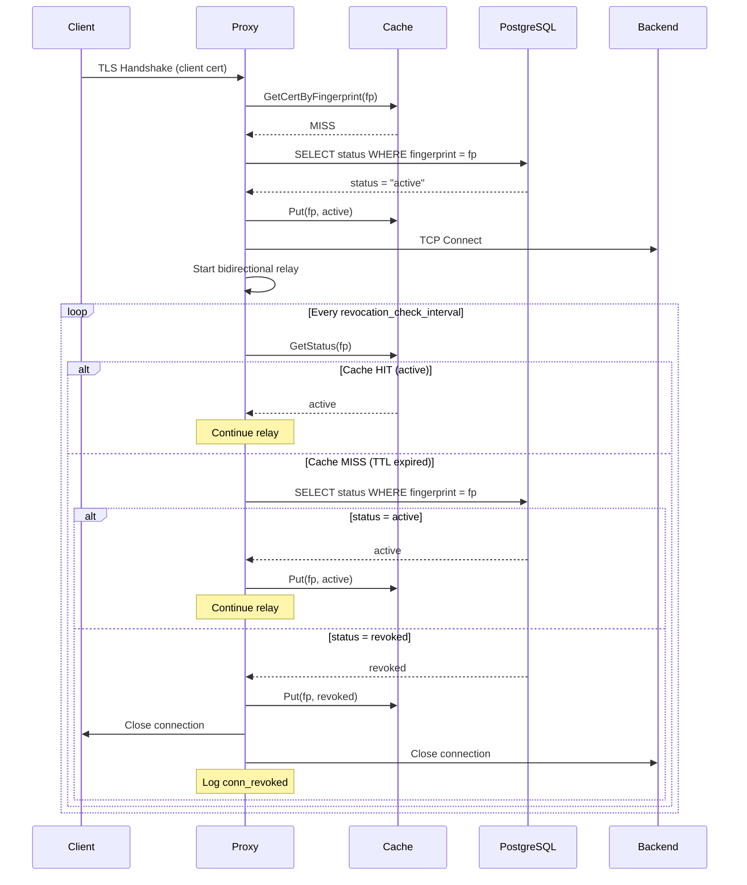

# Talos v0.1.1 — Active Connection Revocation Enforcement

> **Talos** never sleeps. Even after a vessel has been granted passage, the bronze guardian continues to watch — and the moment trust is withdrawn, the passage is sealed.

| Field        | Value      |
| ------------ | ---------- |
| Document ID  | 003        |
| Status       | Draft      |
| Author       | —          |
| Created      | 2026-03-12 |
| Last Updated | 2026-03-12 |

---

## Table of Contents

1. [Business Reason](#1-business-reason)
2. [Business Impact](#2-business-impact)
3. [Use Cases](#3-use-cases)
4. [Acceptance Criteria](#4-acceptance-criteria)
5. [Architecture](#5-architecture)
6. [Component Design](#6-component-design)
7. [Application Configuration](#7-application-configuration)
8. [Security Considerations & Critique](#8-security-considerations--critique)
9. [Technical Feasibility Assessment](#9-technical-feasibility-assessment)
10. [Risks & Mitigations](#10-risks--mitigations)
11. [Future Considerations](#11-future-considerations)

---

## 1. Business Reason

In v0.1.0, Talos validates client certificates only at TLS handshake time. Once a connection is established and enters the bidirectional TCP relay, it runs indefinitely — even if the backing certificate is subsequently revoked. This means a stolen device with an active Redis session remains connected until the application or network disconnects.

For banking-grade security, this is unacceptable. A revoked certificate must result in **termination of all active connections** using that certificate, not just rejection of future connections.

This document specifies the design for periodic revocation re-checks on active proxy connections.

### Reference

This feature was identified in the v0.1.0 design document:

- **Section 11.2** ("Cache TTL Security Tradeoff") documents the revocation latency window but only addresses new connections.
- **Section 16** ("Future Considerations") lists `LISTEN/NOTIFY` cache invalidation as v1.1 — this feature provides a simpler, immediately-deployable mechanism as a bridge.

---

## 2. Business Impact

| Dimension                | Impact |
| ------------------------ | ------ |
| **Security**             | Eliminates the gap where revoked certificates maintain active sessions indefinitely. Worst-case revocation enforcement latency becomes `cache_ttl + revocation_check_interval` (default: 90 seconds) instead of unbounded. |
| **Compliance**           | Strengthens incident response posture: revoking a certificate now guarantees disconnection within a bounded time window. Auditable via the new `conn_revoked` event type. |
| **Operations**           | Zero additional infrastructure. No new dependencies. Configurable interval with a sensible default. Backward-compatible (set interval to `0` to disable). |
| **Availability**         | Negligible performance impact. The re-check hits the in-memory cache in the common case. Database fallback uses the existing connection pool. |
| **Developer Experience** | Transparent to clients. Revoked connections are closed cleanly (TCP FIN). Clients experience a normal disconnect and can implement reconnection logic. |

---

## 3. Use Cases

### UC-1: Terminate Active Session on Certificate Revocation

> **As a** Security Admin,
> **I want** all active proxy connections authenticated with a specific certificate to be terminated when I revoke that certificate,
> **So that** a lost or stolen device cannot continue accessing managed services through existing sessions.

### UC-2: Configurable Re-check Interval

> **As a** Platform Engineer,
> **I want to** configure the frequency of revocation re-checks on active connections,
> **So that** I can balance revocation latency against system resource usage for my deployment.

### UC-3: Backward-Compatible Deployment

> **As a** Platform Engineer,
> **I want** existing configurations without `revocation_check_interval` to continue working unchanged,
> **So that** upgrading to v0.1.1 does not require configuration changes.

---

## 4. Acceptance Criteria

### AC-1: Active Connection Terminated on Revocation

```
AS      a Security Admin
GIVEN   a client has an active proxied connection authenticated with certificate C
WHEN    I revoke certificate C
THEN    the active connection is terminated within (cache_ttl + revocation_check_interval)
AND     a "conn_revoked" audit event is logged with the certificate fingerprint
```

### AC-2: Non-Revoked Connections Unaffected

```
AS      a Developer
GIVEN   I have an active proxied connection with a valid (non-revoked) certificate
WHEN    the revocation re-check fires
THEN    my connection continues without interruption or data loss
```

### AC-3: Fail-Closed on Database Error During Re-check

```
AS      a proxy instance
GIVEN   an active connection exists and the cache entry has expired
WHEN    the revocation re-check queries the database and the database is unreachable
THEN    the connection is terminated (fail-closed)
AND     a "conn_revoked" audit event is logged with reason "database_error"
```

### AC-4: Feature Disabled When Interval Is Zero

```
AS      a Platform Engineer
GIVEN   revocation_check_interval is set to "0s"
WHEN    a proxied connection is established
THEN    no periodic revocation re-checks occur (v0.1.0 behavior)
```

---

## 5. Architecture

### Connection Lifecycle (v0.1.1)



### Relay Architecture (Ticker-Driven)

```
┌─────────────┐                              ┌─────────────┐
│   Client     │◄────────── io.Copy ──────────►│   Backend    │
│  (TLS conn)  │                              │  (TCP conn)  │
└──────┬───────┘                              └──────┬───────┘
       │                                             │
       │                                             │
┌──────┴───────┐        Every `checkInterval`        ┌┴────────────┐
│ Ticker Go    │◄───────────────────────────────────┤ Check Cert  │
│ fires, calls ├──────┐                              │ Status      │
│ check func   │       │                              └─────────────┘
└──────────────┘       │
                       │ If revoked:
                       │   - clientConn.Close()
                       └─► backendConn.Close()
```

The relay logic is managed by three goroutines per connection:
1. Two `io.Copy` goroutines form a bidirectional relay between the client and backend.
2. A third **ticker goroutine** wakes up at every `revocation_check_interval`.

On waking, the ticker performs the revocation check. If the certificate has been revoked (or the check fails), the ticker goroutine immediately calls `Close()` on both the client and backend connections. This action is thread-safe and causes the `io.Copy` operations in the other two goroutines to fail instantly with a "use of closed network connection" error, ensuring a deterministic and immediate teardown of the relay.

This design guarantees that revocation checks are performed consistently, regardless of whether the connection is idle or actively streaming data.

---

## 6. Component Design

### 6.1 New Method: `Cache.GetStatus`

A lightweight, read-only cache lookup that returns only the certificate status. Optimized for the re-check hot path where identity and version are not needed.

```go
func (c *Cache) GetStatus(fingerprint string) (CertificateStatus, bool)
```

### 6.2 New Method: `Server.checkRevocation`

Encapsulates the revocation re-check logic: cache lookup → DB fallback → fail-closed on error.

```go
func (s *Server) checkRevocation(ctx context.Context, fingerprint string) bool
```

Returns `true` if the certificate is still active. Returns `false` (and terminates the connection) if:
- The certificate is revoked
- The certificate is not found in the catalog
- The database is unreachable (fail-closed)

### 6.3 New Method: `Server.relayWithRevocationCheck`

Replaces the simple `io.Copy` relay with a new implementation that supports periodic revocation checks.

**Structure:**
- Two `copyDirection` goroutines: each runs `io.Copy` to shuttle data between the client and backend. They run until the underlying connection is closed.
- One `ticker` goroutine: fires every `checkInterval`, calls `checkRevocation`. If the check indicates the certificate is no longer active, this goroutine calls `Close()` on both the client and backend connections.
- Coordination via a `sync.WaitGroup` to wait for the two `io.Copy` goroutines to exit before the parent `handleConnection` function cleans up.

This approach is simple and robust. The `conn.Close()` call from the ticker goroutine reliably terminates the `io.Copy` loops, regardless of their current state (idle or active).

### 6.4 Fallback: `Server.relaySimple`

The original `io.Copy` relay, extracted to a named method. Used when `RevocationCheckInterval` is `0` (feature disabled).

### 6.5 New Audit Event: `conn_revoked`

```json
{
  "timestamp": "2026-03-12T10:30:05.456Z",
  "level": "warn",
  "event": "conn_revoked",
  "identity": "yusuke.izumi@up-sider.com",
  "cert_version": 2,
  "cert_fingerprint": "SHA256:ab:cd:ef:...",
  "client_ip": "10.0.1.50:52341",
  "reason": "certificate_revoked_during_session",
  "cache_hit": false,
  "backend": "10.128.0.5:6379",
  "duration_ms": 45230,
  "bytes_tx": 1024,
  "bytes_rx": 8192
}
```

---

## 7. Application Configuration

### New Field

```yaml
proxy:
  # Interval for re-checking certificate revocation on active connections.
  # Set to "0s" to disable (v0.1.0 behavior).
  # Default: 30s. Minimum: 1s.
  revocation_check_interval: 30s
```

### Environment Variable Override

```bash
TALOS_PROXY_REVOCATION_CHECK_INTERVAL="15s"
```

### Validation Rules

| Constraint | Rule |
| ---------- | ---- |
| Minimum    | `0s` (disabled) or `>= 1s` |
| Maximum    | None enforced (operator's discretion) |
| Default    | `30s` |

### Worst-Case Revocation Latency

```
T_max = cache_ttl + revocation_check_interval

With defaults (60s + 30s):
  T_max = 90 seconds

With aggressive settings (10s + 5s):
  T_max = 15 seconds
```

---

## 8. Security Considerations & Critique

### 8.1 Strengths

| Decision | Assessment |
| -------- | ---------- |
| **Fail-closed on DB error during re-check** | Consistent with v0.1.0's fail-closed philosophy. A database outage terminates active connections rather than allowing potentially-revoked certificates to maintain access. |
| **Per-connection re-check (not central registry)** | Simpler architecture. No shared mutable state beyond the existing cache. Each goroutine independently manages its connection lifecycle. |
| **Cache absorbs load** | Multiple connections sharing the same fingerprint result in a single DB query per TTL window. 1000 concurrent connections with the same cert = 1 DB query every 60 seconds, not 1000. |

### 8.2 Limitations

| Limitation | Assessment |
| ---------- | ---------- |
| **Revocation is not instant** | Worst case is `cache_ttl + revocation_check_interval`. For true instant revocation, `LISTEN/NOTIFY` push (v1.1) is still needed. |
| **DB outage kills active connections** | Fail-closed means a brief DB hiccup can disconnect legitimate users whose cache entry happened to expire during the outage. This is the correct tradeoff for banking security, but operators should be aware. |
| **No distinction between user-initiated disconnect and revocation** | From the client's perspective, a revoked connection simply closes. The audit log distinguishes the two, but the client does not receive a specific error code. This is inherent to TCP proxying (no application-layer protocol to signal the reason). |

### 8.3 Revocation Timeline Comparison

| Scenario | v0.1.0 | v0.1.1 (defaults) | v0.1.1 (aggressive) |
| -------- | ------ | ------------------ | -------------------- |
| New connection after revocation | 0-60s | 0-60s | 0-10s |
| Active connection after revocation | **Never** | 0-90s | 0-15s |

---

## 9. Technical Feasibility Assessment

### Goroutine Cost

| Metric | v0.1.0 | v0.1.1 |
| ------ | ------ | ------ |
| Goroutines per connection | 2 (2x `io.Copy`) | 3 (2x `io.Copy` + 1x Ticker) |
| Memory per goroutine | ~2-4 KB | ~2-4 KB |
| 1000 connections | ~8 MB | ~12 MB |

The additional goroutine per connection for the ticker is a negligible cost for the security benefit it provides. The termination of goroutines via `conn.Close()` is a standard, low-cost pattern in Go.

---

## 10. Risks & Mitigations

| # | Risk | Severity | Mitigation |
| - | ---- | -------- | ---------- |
| 1 | **DB outage during re-check terminates legitimate connections** | Medium | Operators should monitor DB availability. The cache TTL provides a buffer — connections whose cache entry is still valid are unaffected by a brief outage. |
| 2 | **Very short check intervals increase CPU usage** | Low | Minimum enforced at 1 second. With cache hits, each re-check is a single map lookup under a read lock — negligible cost even at 1s intervals. |

---

## 11. Future Considerations

This feature is a bridge to the more comprehensive revocation mechanisms planned for v1.1:

| Priority | Feature | Relationship to This Design |
| -------- | ------- | --------------------------- |
| **v1.1** | `LISTEN/NOTIFY` cache invalidation | Pushes revocation to all proxy instances within milliseconds. When combined with active connection re-checks, reduces worst-case latency to `revocation_check_interval` only (cache is instantly invalidated). |
| **v1.1** | `talos cache flush` command | Emergency manual flush. Immediately invalidates all cached entries, causing the next re-check to query the DB. |
| **v1.2** | Configurable fail-open for re-checks | For deployments where availability of existing connections is prioritized over instant revocation enforcement during DB outages. Not recommended for banking but useful for less sensitive environments. |

---

## Appendix A: File Changes

| File | Change |
| ---- | ------ |
| `internal/config/config.go` | Add `RevocationCheckInterval` to `ProxyConfig`, default, env override, validation |
| `internal/proxy/cache.go` | Add `GetStatus` method |
| `internal/proxy/proxy.go` | Add `checkRevocation`, `relayWithRevocationCheck`, `relaySimple`; update `handleConnection` and startup log |
| `internal/config/config_test.go` | Tests for new config field, default, env override |
| `internal/proxy/cache_test.go` | Tests for `GetStatus` (hit, miss, expired) |
| `internal/proxy/proxy_test.go` | Integration test: establish connection → revoke cert → verify disconnection |

## Appendix B: Implementation Order

1. Config: add field, default, env override, validation, tests
2. Cache: add `GetStatus`, tests
3. Proxy: add `checkRevocation`, relay methods, update `handleConnection`, tests
4. Run `make lint` and `make test`
