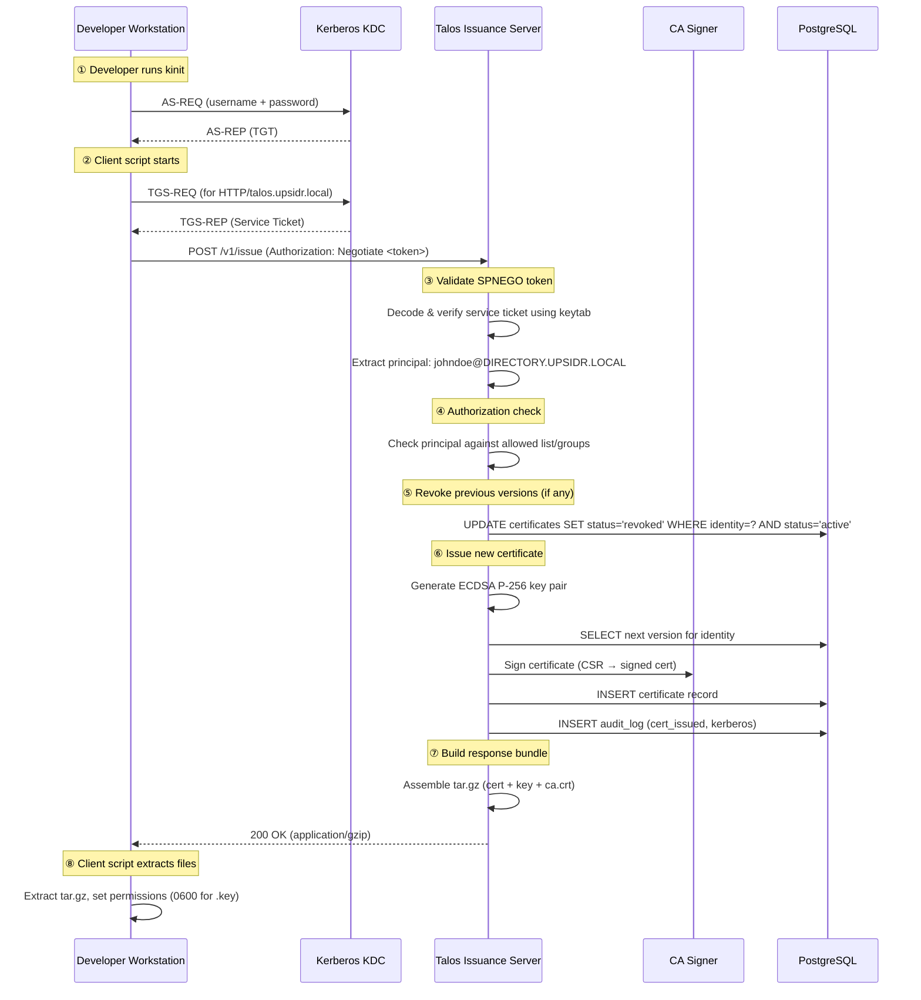

# Talos v0.1.2 — Kerberos-Authenticated Certificate Distribution

> **Hermes**, messenger of the gods, carried sealed scrolls between Olympus and the mortal world — trusted not because of the scrolls themselves, but because only Hermes could prove he was sent by Zeus. In the same way, Talos now entrusts certificates only to those who can prove their identity through the realm's authority.

| Field        | Value      |
| ------------ | ---------- |
| Document ID  | 004        |
| Status       | Draft      |
| Author       | —          |
| Created      | 2026-03-14 |
| Last Updated | 2026-03-14 |

---

## Table of Contents

1. [Business Reason](#1-business-reason)
2. [Business Impact](#2-business-impact)
3. [Actors](#3-actors)
4. [Use Cases](#4-use-cases)
5. [Acceptance Criteria](#5-acceptance-criteria)
6. [Architecture](#6-architecture)
7. [Component Design](#7-component-design)
8. [Data Model](#8-data-model)
9. [CLI Interface Design](#9-cli-interface-design)
10. [Application Configuration](#10-application-configuration)
11. [Security Considerations & Critique](#11-security-considerations--critique)
12. [Technical Feasibility Assessment](#12-technical-feasibility-assessment)
13. [Existing OSS Landscape](#13-existing-oss-landscape)
14. [Assumptions](#14-assumptions)
15. [Risks & Mitigations](#15-risks--mitigations)
16. [Future Considerations](#16-future-considerations)

---

## 1. Business Reason

In the current Talos workflow, client certificates are distributed through **out-of-band channels**: a Platform Engineer runs `talos cert issue`, then sends the resulting `.crt` and `.key` files to the developer via Google Drive, Slack DM, or email. This has two fundamental problems:

1. **Security**: Private keys are transmitted in plaintext over channels not designed for secret distribution. A file shared on Slack persists in message history, is indexed by search, and may be retained on Slack's servers indefinitely. Google Drive links can be forwarded. Email is unencrypted in transit between MTAs.

2. **Operational friction**: The issuance workflow requires a Platform Engineer to act as a manual intermediary. Every certificate issuance, reissuance, or rotation requires back-and-forth coordination. This does not scale beyond a handful of developers.

This document specifies a **self-service certificate issuance endpoint** authenticated by Kerberos (SPNEGO/HTTP Negotiate). Developers authenticate with their existing FreeIPA/Kerberos credentials (via `kinit`) and receive their certificate bundle directly — no intermediary, no plaintext secrets on shared platforms.

### Reference

This feature builds on infrastructure already established in the parent Elpis project:

- **FreeIPA** is deployed as the Kerberos KDC and identity provider for the UPSIDR environment.
- The v0.1.0 design document (Section 16) lists "CSR-based issuance" and "Web UI" as future considerations — this feature provides a simpler, CLI-native mechanism that leverages existing Kerberos infrastructure.

---

## 2. Business Impact

| Dimension                | Impact |
| ------------------------ | ------ |
| **Security**             | Eliminates plaintext private key distribution over Slack/Google Drive/email. Certificate issuance is now authenticated end-to-end: Kerberos proves identity, TLS protects the channel. |
| **Compliance**           | Full audit trail: every issuance request is logged with the authenticated Kerberos principal, client IP, and timestamp. Meets the principle of non-repudiation — only the holder of the Kerberos credential could have requested the certificate. |
| **Operations**           | Self-service eliminates the Platform Engineer bottleneck. Developers can issue and rotate their own certificates without coordination. Reduces mean time to onboard new developers from hours to minutes. |
| **Availability**         | Depends on Kerberos KDC availability for issuance (not for proxy operation — existing certificates continue to work). KDC availability is already a requirement for other Elpis services (SSH, LDAP). |
| **Developer Experience** | Single command to obtain all required credentials. No manual file handling, no waiting for a Platform Engineer. Familiar `kinit` + `curl` workflow. |

---

## 3. Actors

| Actor              | Description |
| ------------------ | ----------- |
| **Developer**      | Holds a Kerberos principal in the FreeIPA realm. Requests client certificates for accessing Talos-proxied services. |
| **Platform Engineer** | Configures and operates the Talos issuance server. Manages the keytab, allowed realms, and certificate policies. |
| **Kerberos KDC**   | FreeIPA server that authenticates principals and issues service tickets. External dependency. |
| **Talos Issuance Server** | New HTTP(S) server component that validates SPNEGO tokens and issues certificates. |

---

## 4. Use Cases

### UC-1: Self-Service Certificate Issuance

> **As a** Developer,
> **I want to** obtain my client certificate, private key, and CA certificate by authenticating with my Kerberos credentials,
> **So that** I can connect to Talos-proxied services without relying on a Platform Engineer to manually distribute files.

### UC-2: Certificate Reissuance via Kerberos

> **As a** Developer,
> **I want to** re-run the issuance command to obtain a new certificate version (revoking previous versions),
> **So that** I can rotate my credentials without Platform Engineer involvement.

### UC-3: Restrict Issuance to Authorized Principals

> **As a** Platform Engineer,
> **I want to** restrict which Kerberos principals (or groups) are authorized to issue certificates,
> **So that** not every FreeIPA user automatically gains access to Talos-proxied services.

---

## 5. Acceptance Criteria

### AC-1: Kerberos-Authenticated Issuance

```
AS      a Developer
GIVEN   I have a valid Kerberos TGT (via kinit)
WHEN    I run the client script targeting the Talos issuance endpoint
THEN    I receive a tar.gz bundle containing my certificate, private key, and CA certificate
AND     the certificate identity matches my Kerberos principal
AND     an audit event "cert_issued" is logged with my principal and client IP
```

### AC-2: Rejected Without Valid Kerberos Ticket

```
AS      a user
GIVEN   I do not have a valid Kerberos TGT (or my ticket has expired)
WHEN    I attempt to access the Talos issuance endpoint
THEN    the request is rejected with HTTP 401 Unauthorized
AND     no certificate is issued
```

### AC-3: Reissuance Revokes Previous Versions

```
AS      a Developer
GIVEN   I already have an active certificate (version N)
WHEN    I run the client script again
THEN    all my active certificate versions are revoked
AND     a new certificate (version N+1) is issued
AND     I receive the new certificate bundle
```

### AC-4: Unauthorized Principal Rejected

```
AS      a Developer
GIVEN   I have a valid Kerberos TGT but my principal is not in the allowed list
WHEN    I attempt to access the Talos issuance endpoint
THEN    the request is rejected with HTTP 403 Forbidden
AND     an audit event is logged with reason "unauthorized_principal"
```

---

## 6. Architecture

### 6.1 High-Level Architecture

```
                              ┌──────────────┐
                              │  FreeIPA     │
                              │  Kerberos    │
                              │  KDC         │
                              └──────┬───────┘
                                     │ ② Service Ticket
                                     │
┌──────────┐  ① kinit   ┌───────────┴────────────┐
│Developer │────────────►│  ③ HTTPS + SPNEGO      │
│Workstation│◄───────────│                        │
│           │  ⑥ Bundle  │  Talos Issuance Server │
└──────────┘             │    :8443               │
                         │  ④ Validate token      │
                         │  ⑤ Issue certificate   │
                         │                        │
                         │  ┌──────────────────┐  │
                         │  │ CA Signer        │  │
                         │  │ (local / KMS)    │  │
                         │  └──────────────────┘  │
                         │                        │
                         └───────────┬────────────┘
                                     │
                              ┌──────┴───────┐
                              │  PostgreSQL  │
                              │  (cert store)│
                              └──────────────┘
```

### 6.2 Issuance Flow



### 6.3 Deployment Topology

```
┌─────────────────────────────────────────────────┐
│                  Elpis Network                  │
│                                                 │
│  ┌─────────────┐         ┌──────────────────┐   │
│  │  FreeIPA    │         │  Talos Server    │   │
│  │  KDC + LDAP │         │                  │   │
│  │             │         │  ┌─────────────┐ │   │
│  │             │◄────────┤  │ Issuance    │ │   │
│  │             │ Kerberos│  │ :8443       │ │   │
│  └─────────────┘         │  └─────────────┘ │   │
│                          │  ┌─────────────┐ │   │
│                          │  │ mTLS Proxy  │ │   │
│                          │  │ :8900       │ │   │
│                          │  └─────────────┘ │   │
│                          └──────────────────┘   │
│                                                 │
└─────────────────────────────────────────────────┘
```

The issuance server and the mTLS proxy run as separate listeners within the same Talos process (or as separate processes sharing the same database and CA). They share:
- The CA signer (for certificate signing)
- The PostgreSQL database (for certificate storage and audit)
- The configuration file

They do **not** share:
- TLS configuration (the issuance server uses standard TLS; the proxy uses mTLS)
- Authentication mechanism (the issuance server uses SPNEGO; the proxy uses client certificates)

---

## 7. Component Design

### 7.1 SPNEGO Authentication Middleware

| Responsibility | Description |
| -------------- | ----------- |
| Token extraction | Extract `Authorization: Negotiate <base64>` header from HTTP request |
| Token validation | Decode SPNEGO token, validate service ticket against keytab |
| Principal extraction | Extract authenticated principal name from validated ticket |
| Context injection | Add authenticated principal to request context for downstream handlers |
| Error handling | Return `401` with `WWW-Authenticate: Negotiate` on authentication failure |

**Lifecycle:**

1. Client sends `POST /v1/issue` without `Authorization` header (or with expired token).
2. Server responds `401 Unauthorized` with `WWW-Authenticate: Negotiate`.
3. Client's HTTP library (curl `--negotiate`) obtains a service ticket from the KDC and resends with `Authorization: Negotiate <token>`.
4. Middleware decodes the SPNEGO wrapper, extracts the AP-REQ, validates it against the keytab.
5. On success, the middleware injects the principal name into the request context and calls the next handler.
6. On failure, returns `401` (invalid token) or `403` (valid but unauthorized principal).

### 7.2 Issuance Handler

| Responsibility | Description |
| -------------- | ----------- |
| Authorization | Check principal against allowed list/groups |
| Revocation | Revoke all active certificates for the identity (reissue semantics) |
| Key generation | Generate ECDSA P-256 key pair |
| Certificate issuance | Create X.509 certificate, sign with CA, store in database |
| Bundle assembly | Build tar.gz response with cert, key, and CA cert |
| Audit logging | Log issuance event with principal, client IP, certificate fingerprint |

**Lifecycle:**

1. Extract authenticated principal from context.
2. Map principal to Talos identity (configurable strategy — see Section 10).
3. Check authorization (allowed principals/groups).
4. Revoke all active certificates for this identity (same logic as `talos cert reissue`).
5. Determine next version number for the identity.
6. Generate ECDSA P-256 key pair (in memory — **never written to disk on server**).
7. Build X.509 certificate template with identity, validity, serial number.
8. Sign with CA signer (local or KMS).
9. Store certificate record in database.
10. Log `cert_issued` audit event with `issued_via: "kerberos"`.
11. Build tar.gz response:
    - `{identity}--v{version}.crt` (certificate PEM)
    - `{identity}--v{version}.key` (private key PEM)
    - `ca.crt` (CA certificate PEM)
12. Stream response with `Content-Type: application/gzip`.
13. Zero the private key bytes in memory after response is sent.

### 7.3 Bundle Format

The response is a gzip-compressed tar archive. File layout:

```
johndoe@directory.upsidr.local--v1.crt      # Client certificate (PEM)
johndoe@directory.upsidr.local--v1.key      # Client private key (PEM)
ca.crt                                    # CA certificate (PEM)
```

Tar metadata:
- File mode: `0600` for `.key` files, `0644` for all others
- Owner/group: `0/0` (root) — the client script adjusts ownership on extraction

### 7.4 Client Script

A portable Bash script distributed via GitHub Releases. Handles the SPNEGO-authenticated download and file extraction.

**Responsibilities:**

1. Parse arguments (Talos server hostname, optional output directory).
2. Verify prerequisites (`kinit` has been run, `curl` available, `tar` available).
3. Detect the authenticated Kerberos principal from `klist`.
4. Make HTTPS request to `https://{server}:8443/v1/issue` with `--negotiate`.
5. Extract tar.gz response to the output directory.
6. Set file permissions (`chmod 0600` on `.key` files).
7. Print summary of downloaded files.

---

## 8. Data Model

### 8.1 Schema Changes

No new tables are required. The existing schema supports this feature with minor additions to how existing columns are used:

| Column | Table | Usage |
| ------ | ----- | ----- |
| `identity` | `certificates` | Set to the mapped Kerberos principal (e.g., `johndoe@directory.upsidr.local`) |
| `issued_by` | `certificates` | Set to `kerberos:{principal}` to distinguish from CLI-issued certificates |
| `details` | `audit_log` | JSONB includes `"issued_via": "kerberos"`, `"kerberos_principal": "..."`, `"client_ip": "..."` |

### 8.2 Audit Log Event

```json
{
  "action": "cert_issued",
  "identity": "johndoe@directory.upsidr.local",
  "actor": "kerberos:johndoe@DIRECTORY.UPSIDR.LOCAL",
  "details": {
    "issued_via": "kerberos",
    "kerberos_principal": "johndoe@DIRECTORY.UPSIDR.LOCAL",
    "kerberos_realm": "DIRECTORY.UPSIDR.LOCAL",
    "certificate_version": 1,
    "fingerprint": "SHA256:ab:cd:ef:...",
    "validity_days": 90,
    "previous_versions_revoked": 0
  },
  "client_ip": "10.0.1.100"
}
```

---

## 9. CLI Interface Design

### 9.1 Server Command

```bash
# Start the issuance server (alongside or instead of the proxy)
$ talos issuance serve -c talos.yaml

2026-03-14T10:00:00.000Z  INFO  issuance server starting
  {"address": ":8443", "kerberos_realm": "DIRECTORY.UPSIDR.LOCAL",
   "service_principal": "HTTP/talos.upsidr.local"}
```

### 9.2 Client Script

```bash
# Download and run the client script
$ curl -sSL https://github.com/upsidr/talos/releases/download/v0.1.2/client.sh \
    | bash -s -- talos.upsidr.local

Using identity: johndoe@DIRECTORY.UPSIDR.LOCAL
Connecting to talos.upsidr.local:8443...
Issuing certificate... Complete
Downloading... Complete

Files downloaded:
  johndoe@directory.upsidr.local--v1.crt
  johndoe@directory.upsidr.local--v1.key
  ca.crt
```

```bash
# With custom output directory
$ bash client.sh talos.upsidr.local --out-dir ~/.talos/

# With custom port
$ bash client.sh talos.upsidr.local --port 9443
```

### 9.3 Client Script Error Cases

```bash
# No Kerberos ticket
$ bash client.sh talos.upsidr.local
Error: No valid Kerberos ticket found. Run 'kinit <principal>' first.

# Unauthorized principal
$ bash client.sh talos.upsidr.local
Using identity: contractor@DIRECTORY.UPSIDR.LOCAL
Error: 403 Forbidden — principal is not authorized for certificate issuance.

# Server unreachable
$ bash client.sh talos.upsidr.local
Error: Could not connect to talos.upsidr.local:8443. Check that the issuance server is running.
```

---

## 10. Application Configuration

### 10.1 Full Configuration

```yaml
issuance:
  # Address for the HTTPS issuance server.
  listen_address: ":8443"

  tls:
    # TLS certificate and key for the issuance endpoint itself.
    # This is standard TLS (not mTLS) — authentication is via Kerberos.
    certificate_path: /etc/talos/issuance-server.crt
    key_path: /etc/talos/issuance-server.key

  kerberos:
    # Path to the keytab file containing the service principal's key.
    keytab_path: /etc/krb5.keytab

    # The service principal name registered in the KDC.
    # Must match the SPN the client requests a ticket for.
    service_principal: HTTP/talos.upsidr.local@DIRECTORY.UPSIDR.LOCAL

    # Kerberos realms accepted for authentication.
    # Principals from other realms are rejected.
    allowed_realms:
      - DIRECTORY.UPSIDR.LOCAL

    # Optional: restrict issuance to specific principals or groups.
    # If empty, all authenticated principals from allowed realms are permitted.
    allowed_principals: []
    #  - johndoe@DIRECTORY.UPSIDR.LOCAL
    #  - dev-team@DIRECTORY.UPSIDR.LOCAL

  identity_mapping:
    # How to derive the Talos certificate identity from the Kerberos principal.
    #   "principal" — use full principal, lowercased (e.g., johndoe@directory.upsidr.local)
    #   "username"  — use only the username part (e.g., johndoe)
    strategy: principal

  certificate:
    # Override default certificate validity for Kerberos-issued certs.
    # Falls back to the global certificate.default_validity if not set.
    expires_in: 90d
```

### 10.2 Environment Variable Overrides

```bash
TALOS_ISSUANCE_LISTEN_ADDRESS=":9443"
TALOS_ISSUANCE_KERBEROS_KEYTAB_PATH="/alt/path/krb5.keytab"
TALOS_ISSUANCE_KERBEROS_SERVICE_PRINCIPAL="HTTP/alt.host@REALM"
TALOS_ISSUANCE_IDENTITY_MAPPING_STRATEGY="username"
```

### 10.3 Minimal Development Configuration

```yaml
issuance:
  listen_address: ":8443"
  tls:
    certificate_path: dev/issuance-server.crt
    key_path: dev/issuance-server.key
  kerberos:
    keytab_path: dev/talos.keytab
    service_principal: HTTP/localhost@EXAMPLE.COM
    allowed_realms:
      - EXAMPLE.COM
  identity_mapping:
    strategy: principal
```

---

## 11. Security Considerations & Critique

### 11.1 Validated: Strong Design Choices

| Decision | Assessment |
| -------- | ---------- |
| **Kerberos (SPNEGO) for authentication** | Proven, enterprise-grade authentication protocol. Mutual authentication between client and server. Time-limited tickets prevent credential replay. Integrates with existing FreeIPA infrastructure — no new identity system. |
| **TLS for transport** | Private key material is transmitted over an encrypted channel. Even if the network is compromised, the certificate bundle cannot be intercepted without breaking TLS. |
| **Reissue semantics (revoke-then-issue)** | Every issuance request revokes previous active versions. This prevents credential accumulation and ensures a single active certificate per identity at any time. |
| **Audit trail** | Every issuance is logged with the Kerberos principal, client IP, and certificate fingerprint. Combined with Kerberos's non-repudiation properties, this provides strong accountability. |
| **No new identity system** | Talos leverages the existing FreeIPA/Kerberos identity. No new passwords, no new user database, no new authentication protocol to audit. |

### 11.2 Critique & Required Changes

#### CRITICAL-1: Server-Side Private Key Generation

**Issue:** The private key is generated on the Talos server and transmitted to the client. This means the server has transient access to the client's private key. If the server is compromised, an attacker could intercept or log private keys.

**Assessment:** This is an inherent tradeoff of the server-side issuance model. The alternative — CSR-based issuance where the client generates the key pair and submits only a CSR — is more secure but significantly more complex for the user (requires OpenSSL knowledge or a dedicated client binary).

**Design decision:** Accept this tradeoff for v0.1.2. The private key:
- Is generated in memory (never written to disk on the server).
- Is zeroed from server memory immediately after the HTTP response is sent.
- Is transmitted over TLS, so it is encrypted in transit.
- The issuance server should be treated as a high-value target — equivalent to a CA in terms of security posture.

**Future mitigation (v1.2):** Implement CSR-based issuance as an opt-in mode. The client binary generates the key pair locally and submits a CSR over the SPNEGO-authenticated channel. The server signs the CSR and returns only the certificate (no private key in the response).

#### IMPORTANT-1: `curl | bash` Distribution Model

**Issue:** The client script is downloaded and executed via `curl | bash`. This pattern is vulnerable to:
- **Man-in-the-middle**: An attacker on the network path could inject malicious code into the script (mitigated by HTTPS to GitHub, but relies on trusting GitHub's TLS certificate and DNS).
- **Partial download execution**: If the connection drops mid-download, Bash may execute a truncated script. `set -euo pipefail` at the top of the script mitigates most truncation scenarios, but not all.
- **Supply chain compromise**: If the GitHub repository or release pipeline is compromised, the attacker controls the script.

**Design decision:**
- The `curl | bash` approach is documented as a **convenience option** for initial setup.
- The client script is also available as a **direct download** with SHA-256 checksums published in the release notes.
- **Recommended production workflow:** Download the script once, verify its checksum, and store it in the organization's internal artifact repository.
- Future: Distribute a compiled Go binary (`talos-client`) that embeds the issuance logic, eliminating the need for Bash entirely.

#### IMPORTANT-2: Authorization Granularity

**Issue:** The current design authorizes based on Kerberos principal name only. There is no concept of roles, groups, or per-service access control. Any authorized principal can issue a certificate that grants access to **all** Talos-proxied backends.

**Design decision:** Acceptable for v0.1.2 given the small team size. The `allowed_principals` list provides a basic allowlist.

**Future mitigation (v1.2):** Integrate with FreeIPA LDAP groups for authorization. Map LDAP groups to backend-specific access policies. Example: members of `cn=redis-users,cn=groups,...` can issue certificates for Redis backends but not PostgreSQL.

#### IMPORTANT-3: Keytab Security

**Issue:** The keytab file (`/etc/krb5.keytab`) contains the service's long-term secret key. If an attacker obtains the keytab, they can:
- Impersonate the Talos issuance service.
- Decrypt past SPNEGO tokens (if the session key was derived from the keytab).
- Forge service tickets.

**Design decision:** The keytab must be:
- Owned by root, permissions `0400`.
- Stored outside of version control.
- Rotated periodically via `ipa-getkeytab`.
- Documented as a critical secret in the operations runbook.

#### NOTABLE-1: No Mutual TLS on the Issuance Endpoint

**Issue:** The issuance endpoint uses standard TLS (server-authenticated only), not mTLS. Authentication is entirely via Kerberos. This means the endpoint is accessible to anyone who can reach it on the network — Kerberos provides identity verification but not network-level access control.

**Design decision:** This is intentional. The issuance endpoint must be accessible to developers who **do not yet have** a client certificate (that is the whole point). Network-level access control should be enforced at the firewall/security group level (restrict `:8443` to the office network or VPN CIDR).

---

## 12. Technical Feasibility Assessment

### 12.1 Go Kerberos/SPNEGO Library

| Aspect | Detail |
| ------ | ------ |
| **Library** | [jcmturner/gokrb5](https://github.com/jcmturner/gokrb5) v8 |
| **Capabilities** | Full Kerberos 5 client and server. SPNEGO token parsing. Keytab loading. Service ticket validation. |
| **Maturity** | Well-established, used in production by Kafka Go clients, Hadoop ecosystem tools, and others. |
| **HTTP integration** | Provides `spnego.SPNEGOKRB5Authenticate` middleware for `net/http`. |
| **Verdict** | **Fully feasible.** The library handles the entire SPNEGO flow. No CGo or external C libraries required. |

### 12.2 Tar.gz Response Assembly

| Aspect | Detail |
| ------ | ------ |
| **Libraries** | Go stdlib: `archive/tar`, `compress/gzip` |
| **Approach** | Build tar archive in memory, gzip-compress, stream as HTTP response |
| **Memory** | Certificate bundles are small (< 100 KB typically). In-memory assembly is appropriate. |
| **Verdict** | **Fully feasible.** No external dependencies. |

### 12.3 curl `--negotiate` Support

| Aspect | Detail |
| ------ | ------ |
| **Requirement** | `curl` must be compiled with SPNEGO support (GSS-API) |
| **macOS** | Default curl supports `--negotiate` via GSS.framework |
| **Linux (RHEL/Fedora)** | Default curl supports `--negotiate` via libgssapi_krb5 |
| **Linux (Debian/Ubuntu)** | May require `curl` compiled with `--with-gssapi` or installing `libcurl4-gssapi-dev` |
| **Verdict** | **Feasible with caveats.** The client script should check for SPNEGO support and provide a helpful error message if unavailable. |

### 12.4 Performance

| Operation | Latency | Notes |
| --------- | ------- | ----- |
| SPNEGO token validation | < 5 ms | In-memory keytab lookup, no KDC roundtrip for validation |
| ECDSA P-256 key generation | < 1 ms | crypto/ecdsa on modern hardware |
| Certificate signing (local) | < 1 ms | ECDSA signature |
| Database operations | ~ 5 ms | Revoke old + insert new + audit log (3 queries, single transaction) |
| Tar.gz assembly | < 1 ms | Small payload, in-memory |
| **Total** | **< 15 ms** | Excluding network latency |

Certificate issuance is a low-frequency operation (per user, not per connection), so performance is not a meaningful concern. A single Talos instance can comfortably handle hundreds of concurrent issuance requests.

---

## 13. Existing OSS Landscape

| Project | Category | Relevant Capabilities | Why Not Sufficient |
| ------- | -------- | --------------------- | ---- |
| **HashiCorp Vault PKI** | Secrets management + PKI | Full CA, cert issuance, CRL, LDAP/Kerberos auth backends | Full Vault deployment is operationally heavy for this use case. Talos already has its own CA and certificate store — adding Vault would duplicate the PKI stack. |
| **Smallstep Certificates** | ACME-based CA | OIDC/ACME-based cert issuance, short-lived certs | No native Kerberos/SPNEGO support. Would require an OIDC bridge. |
| **certbot / ACME** | Certificate issuance | Automated cert issuance via ACME protocol | ACME is designed for server certificates (domain validation), not client certificates with identity-based authentication. |
| **FreeIPA certmonger** | Certificate monitoring | Integrated with FreeIPA, auto-renewal | Designed for host certificates, not arbitrary client certificate issuance with custom CA. |

**Value proposition:** Talos v0.1.2 provides a **single-command, Kerberos-authenticated** certificate issuance flow that is tightly integrated with the existing Talos proxy. No additional infrastructure (Vault, ACME server) is required.

---

## 14. Assumptions

| # | Assumption | Rationale |
| - | ---------- | --------- |
| 1 | FreeIPA Kerberos KDC is operational and reachable from the Talos server | FreeIPA is the cornerstone of the Elpis infrastructure; its availability is already a hard dependency for SSH and LDAP. |
| 2 | Developers have `kinit` and a SPNEGO-capable `curl` on their workstations | macOS and RHEL/Fedora include these by default. Ubuntu may require a package install. |
| 3 | A service principal (`HTTP/talos.upsidr.local`) and keytab are provisioned in FreeIPA | Standard FreeIPA service management: `ipa service-add HTTP/talos.upsidr.local && ipa-getkeytab ...` |
| 4 | The issuance endpoint is network-accessible to developers (firewall rules permit `:8443`) | Talos server is already reachable by developers for mTLS proxy connections. |
| 5 | Certificate issuance volume is low (< 100/day) | Human-initiated, not automated. Scales linearly with team size. |

---

## 15. Risks & Mitigations

| # | Risk | Severity | Mitigation |
| - | ---- | -------- | ---------- |
| 1 | **KDC unavailability blocks all certificate issuance** | Medium | KDC availability is already a hard dependency for other Elpis services. FreeIPA supports replication for HA. Issuance is non-urgent — a brief outage delays onboarding but does not affect existing connections. |
| 2 | **Keytab compromise allows service impersonation** | High | Strict file permissions (0400, root-owned). Rotate keytab periodically. Monitor FreeIPA audit logs for anomalous service ticket requests. |
| 3 | **Server compromise exposes private keys in transit** | High | Private keys exist in server memory only during the request lifecycle. Zeroed immediately after response. Server should be hardened (minimal attack surface, restricted network access, OS-level security). Move to CSR-based issuance in v1.2 to eliminate this risk entirely. |
| 4 | **`curl \| bash` script tampered via supply chain** | Medium | Publish SHA-256 checksums in release notes. Recommend pre-downloading and verifying the script. Future: distribute compiled binary with signature verification. |
| 5 | **SPNEGO not available on all developer workstations** | Low | Document prerequisites. Provide a fallback client binary that handles SPNEGO internally (using gokrb5 library) without relying on system curl. |
| 6 | **Identity mapping collisions across realms** | Low | Restrict to a single realm in v0.1.2 (`allowed_realms`). Use full principal (including realm) as identity by default. |

---

## 16. Future Considerations

| Priority | Feature | Description |
| -------- | ------- | ----------- |
| **v0.1.3** | `talos-client` binary | Compiled Go client that replaces the Bash script. Handles SPNEGO internally (no system curl dependency). Supports interactive prompts, progress bars, and automatic `~/.talos/` directory management. |
| **v1.2** | CSR-based issuance | Client generates key pair locally, submits CSR over the SPNEGO-authenticated channel. Server returns only the signed certificate. Private key never leaves the client machine. |
| **v1.2** | LDAP group-based authorization | Query FreeIPA LDAP for group membership. Map groups to per-backend access policies. |
| **v1.2** | Certificate auto-renewal | `talos-client` daemon mode that monitors certificate expiry and automatically reissues before expiration. Requires valid Kerberos ticket (can use keytab for service accounts). |
| **v2.0** | Web UI for issuance | Browser-based issuance flow using SPNEGO (browsers natively support `Negotiate` auth). Useful for less technical users who are uncomfortable with CLI tools. |

---

## Appendix A: Client Script Reference Implementation

```bash
#!/usr/bin/env bash
set -euo pipefail

# Talos Certificate Issuance Client
# Usage: bash client.sh <server-hostname> [--port PORT] [--out-dir DIR]

readonly VERSION="0.1.2"
readonly DEFAULT_PORT="8443"
readonly DEFAULT_OUT_DIR="."

main() {
    local server=""
    local port="${DEFAULT_PORT}"
    local out_dir="${DEFAULT_OUT_DIR}"

    # Parse arguments
    while [[ $# -gt 0 ]]; do
        case "$1" in
            --port)   port="$2"; shift 2 ;;
            --out-dir) out_dir="$2"; shift 2 ;;
            --help|-h) usage; exit 0 ;;
            -*)        echo "Error: Unknown option $1" >&2; usage; exit 1 ;;
            *)         server="$1"; shift ;;
        esac
    done

    if [[ -z "${server}" ]]; then
        echo "Error: Server hostname is required." >&2
        usage
        exit 1
    fi

    # Check prerequisites
    command -v curl >/dev/null 2>&1 || { echo "Error: curl is required." >&2; exit 1; }
    command -v tar  >/dev/null 2>&1 || { echo "Error: tar is required." >&2; exit 1; }
    command -v klist >/dev/null 2>&1 || { echo "Error: klist (Kerberos) is required." >&2; exit 1; }

    # Verify Kerberos ticket
    if ! klist -s 2>/dev/null; then
        echo "Error: No valid Kerberos ticket found. Run 'kinit <principal>' first." >&2
        exit 1
    fi

    local principal
    principal=$(klist 2>/dev/null | grep "Default principal:" | awk '{print $3}')
    echo "Using identity: ${principal}"

    # Create output directory if needed
    mkdir -p "${out_dir}"

    # Request certificate bundle
    echo "Connecting to ${server}:${port}..."
    local tmpfile
    tmpfile=$(mktemp)
    trap 'rm -f "${tmpfile}"' EXIT

    local http_code
    http_code=$(curl -s -o "${tmpfile}" -w "%{http_code}" \
        --negotiate -u : \
        "https://${server}:${port}/v1/issue")

    case "${http_code}" in
        200)
            echo "Issuing certificate... Complete"
            ;;
        401)
            echo "Error: Authentication failed. Your Kerberos ticket may be invalid or expired." >&2
            exit 1
            ;;
        403)
            echo "Error: 403 Forbidden — principal is not authorized for certificate issuance." >&2
            exit 1
            ;;
        *)
            echo "Error: Server returned HTTP ${http_code}." >&2
            exit 1
            ;;
    esac

    # Extract bundle
    echo "Downloading... Complete"
    tar -xzf "${tmpfile}" -C "${out_dir}"

    # Set permissions
    find "${out_dir}" -name '*.key' -exec chmod 0600 {} \;

    # List extracted files
    echo ""
    echo "Files downloaded:"
    tar -tzf "${tmpfile}" | while read -r f; do
        echo "  ${f}"
    done
}

usage() {
    echo "Usage: client.sh <server-hostname> [--port PORT] [--out-dir DIR]"
    echo ""
    echo "Options:"
    echo "  --port PORT     Issuance server port (default: ${DEFAULT_PORT})"
    echo "  --out-dir DIR   Output directory (default: current directory)"
    echo "  --help, -h      Show this help message"
}

main "$@"
```

## Appendix B: File Changes

| File | Change |
| ---- | ------ |
| `internal/config/config.go` | Add `IssuanceConfig` struct with TLS, Kerberos, identity mapping, and certificate fields |
| `internal/issuance/server.go` | New: HTTPS server with SPNEGO middleware and issuance handler |
| `internal/issuance/spnego.go` | New: SPNEGO token validation and principal extraction using gokrb5 |
| `internal/issuance/bundle.go` | New: Tar.gz bundle assembly (cert + key + CA cert) |
| `cmd/talos/issuance_cmd.go` | New: `talos issuance serve` subcommand |
| `scripts/client.sh` | New: Client-side issuance script |
| `go.mod` | Add `github.com/jcmturner/gokrb5/v8` dependency |

## Appendix C: Implementation Order

1. Config: add `IssuanceConfig` struct, parsing, validation, env overrides, tests
2. Bundle: tar.gz assembly logic, tests
3. SPNEGO: keytab loading, token validation middleware, tests (using gokrb5 test utilities)
4. Issuance handler: wire up SPNEGO → authorization → cert issuance → bundle response, tests
5. CLI: `talos issuance serve` command
6. Client script: `scripts/client.sh`
7. Run `make lint` and `make test`
